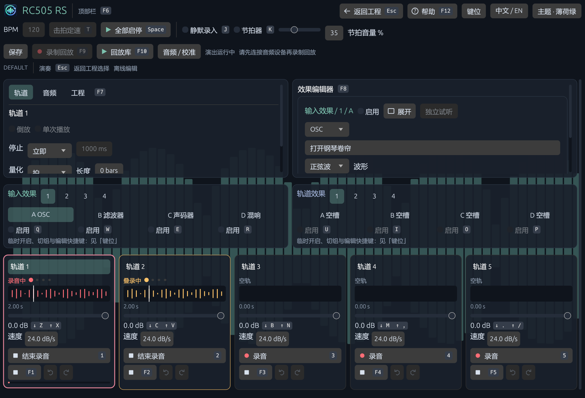
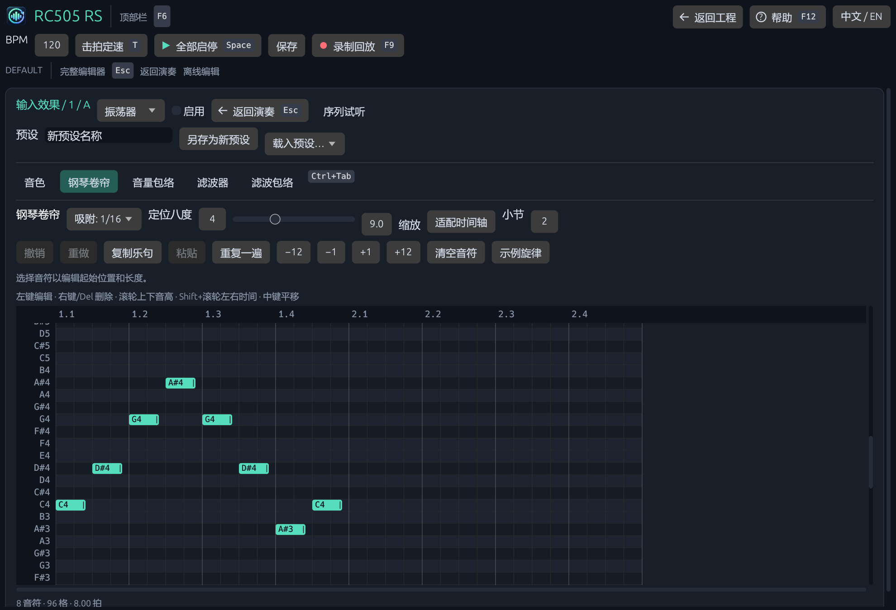

# RC505 RS

面向键盘演奏和鼠标音色编辑的五轨 Loop Station。使用 Rust、CPAL、egui，逐步参考 RC‑505mkII 的操作语义，同时提供钢琴卷帘和参数可视化。

[English](README.md) · [下载安装包](https://github.com/Yishanka/RC505_RS/releases) · [详细操作手册](docs/USER_GUIDE_CN.md) · [安装与更新](docs/INSTALL_UPDATE_CN.md) · [规划](AGENTS/PLAN.md)



## 安装与使用

Windows x64 安装包可以分别选择程序、数据、下载目录。数据默认放在程序旁的 `data` 中；升级和卸载保留工程、音频、回放。安装向导可复制旧 `%APPDATA%\rc505_rs` 数据，原件保留。

启动进入工程选择页。打开工程后，左侧 **Audio** 检查设备，顶栏设置 BPM。按 `1` 录音，再按结束并循环；播放时再按进入叠录，`Shift+1` 或 `F1` 停止。**Ctrl+Shift+S 保存 config 与音频 snapshot**；Ctrl+S 只保存config并保留上一份音频snapshot。

| 操作 | 按键 |
|---|---|
| 轨1–5录放/叠录/完成 | `1`–`5` |
| 停止 / 全部开始或停止 | `Shift+1`–`Shift+5` 或 F1–F5 / `Space` |
| 选轨 | `Ctrl+1`–`Ctrl+5` |
| 对应轨撤销 / 重做 | `Alt+1`–`Alt+5` / `Ctrl+Alt+1`–`Ctrl+Alt+5` |
| Input / Track FX | `Q W E R` / `U I O P` |
| 临时FX / 直接选bank / 编辑槽 | `Shift` / `Alt` / `Ctrl` + FX键 |
| 五轨推子下/上 | `Z X`、`C V`、`B N`、`M ,`、`. /` |
| 逐轨调整推子变化速度 | `Shift` + 对应推子键 |
| 顶部 / 左面板 / 效果面板 | `F6` / `F7` / `F8` |
| 返回演奏，再返回工程 / 帮助 | `Esc` / `F12` |
| 录制回放 / 回放库 | `F9` / `F10` |
| 清空所选轨 | 长按 `Delete` 0.75 秒，或 350 ms 内双击 |

推子短按0.5 dB，长按180 ms后逐渐加速；每轨速度1–60 dB/s。支持多键独立控制。参数/文本编辑与演奏键隔离，完整快捷键见内置帮助。

## 音频、回放与编辑

- 五轨独立Reverse、One Shot、立即/loop结束/淡出停止、固定录音长度及量化；每轨最多 8 步录音/叠录/清空撤销与重做。
- 后台保存32-bit float WAV、版本化快照和校验清单。工程重开保持config与音频，恢复为停止状态。
- 回放记录原始输入与采样编号操作，运行同一DSP重算WAV；复现操作状态的临时回放面板、导入原工程或新工程；直接删除/恢复回放与工程。
- 单一输出采样时钟、有界控制队列、分页音频和后台回收；输入时钟适配、欠载/回调耗时统计及物理回环补偿建议。
- 顶部节拍器与音量、独立 FX 序列试听、后台 FFT 频谱背景；节拍器与试听不录入轨道或导出音频。
- 固定布局快速面板；展开编辑器支持单声部钢琴卷帘、拖动/改长度、撤销、复制、移调、吸附、滤波响应和AHDSR图。
- 已有FX：Oscillator、Filter、Reverb、MyDelay、Vocoder、Track Delay/Roll/Filter。可选旧分组顺序或Input FX槽位A→D；本版没有增加FX类型。



回放从五轨已停止的状态开始，重置FX尾音；结束前需完成录音/叠录。单轨最长5分钟，单次回放最长30分钟。存档和回放的边界、精度、导入与失败处理见[完整手册](docs/USER_GUIDE_CN.md)。

实现参考[BOSS官方参数手册](https://static.roland.com/assets/media/pdf/RC-505mk2_Parameter_eng04_W.pdf)，但仍包含软件扩展；没有实机A/B，不宣称音色等同硬件。声卡物理延迟和真实多键能力仍需设备实测。

## 开发和发布

```powershell
cargo check --all-targets
cargo test --all-targets
cargo build --release --bins
cargo run --bin rc505_rs -- --offline --data-dir=var/development
```

修改版本号、推送main和对应 `v版本` tag 后，GitHub Actions验证并发布安装包、ZIP、SHA-256与更新清单。安装版 **F12 → Updates** 检查更新，保存音频快照后正常退出再安装。详见[发布通路](docs/INSTALL_UPDATE_CN.md)。FFmpeg不是本版依赖。

[架构](docs/ARCHITECTURE.md) · [验证](docs/VALIDATION.md) · [硬件对照](docs/RC505_REFERENCE.md) · [开发约定](AGENTS.md)

待评审设计：[钢琴卷帘、预设与合成/采样音源](docs/DESIGN_SYNTH_SEQUENCER_CN.md) · [RC‑505mkII 完整 FX 清单及中文解释](docs/RC505_MK2_FX_CATALOG_CN.md)。这些是后续设计提案，不是当前版本已提供的功能。

顶部 **主题** 可选择薄荷绿、雾粉、橙红，图标保持不变；**中文 / EN** 可即时切换语言并记住设置。灰底键帽表示快捷键；`F6` 进入顶部栏。返回工程会先提示保存。

**耳机与声卡输出**：默认跟随 Windows 系统输出，运行中更换默认设备也会自动切换；不按耳机品牌特判。左侧「音频」可查看实际输出，或取消「跟随系统输出设备」后手动固定声卡。详见[输出设备说明](docs/USER_GUIDE_CN.md#自动跟随输出设备025)。
