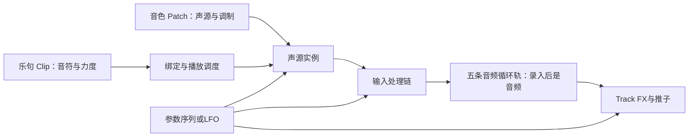

[优先依据：BOSS RC‑505mkII 官方参数手册 rev.04](https://static.roland.com/assets/media/pdf/RC-505mk2_Parameter_eng04_W.pdf) · [完整 FX 清单与中文解释](RC505_MK2_FX_CATALOG_CN.md)

# RC505 RS：钢琴卷帘、预设、采样音源与调制设计

日期：2026-10-03。代码基线：0.2.8 / `cfdf433`。状态：**设计提案，尚未实现**。这份文档提供可评审的默认方案，不改变当前工程、音色、回放格式或“不新增 FX 类型”的实施约束。

文中采用三个证据等级：**官方确认**指公开手册明确记载；**代码确认**指当前仓库实际行为；**设计建议/算法假设**指本项目拟采用的方案。未拿到 BOSS 的专有 DSP 实现，也没有做实机音频 A/B；不能把下面的候选算法叫作官方内部算法。

## 1. 建议先采用的结论

| 问题 | 建议 |
|---|---|
| 钢琴卷帘要不要支持和弦？ | 要。音符数据支持重叠；音源另选 Mono/Poly。Bass 可保持单音，Pad、和声可复音。 |
| 卷帘属于通道还是 FX？ | **共用编辑器、独立乐句、绑定能接收音符的声源实例**。保留从当前槽位进入的快捷入口，不给每个音频效果复制一套卷帘。 |
| 音色和旋律怎么保存？ | 默认拆成“音色预设”和“乐句”；需要一起分享时显式保存“组合预设”。换音色默认保留旋律。 |
| MyDelay 要不要用其他 Delay 替换？ | 保留它的采样音源价值，改造捕获与循环核心；与 Oscillator 共用声部、包络、调制和编辑框架。Panning Delay 属于回声处理，Granular 属于片段处理，都不直接顶替它。 |
| AHDSR 和 LFO 能否共用？ | 共用曲线编辑和底层插值；保留两种独立播放语义。当前右侧参数仍属于包络形状，不应标成完整 LFO。 |
| 后续 Track FX 先做什么？ | 先研究移调/弯音/低八度核心，再考虑更复杂的和声、音高修正与颗粒算法；本轮只规划。 |

## 2. RC‑505mkII 到底能不能做和声

**能录制、叠加和声；也有和声处理器，但不能据此认定 OSC BOT 是完整复音合成器。** 官方列出 HRM MANUAL、由 MIDI 和弦参与控制的 HRM AUTO (M)，以及 MIDI 驱动的 OSC VOC (M)。OSC BOT 公开的是单个 NOTE 参数，可由 FX 序列改变；FX 序列最多 16 步，目标是参数。手册没有为 OSC BOT 给出任意和弦音符列表或复音声部数。AUTO RIFF 的单音输入限制也不能推广到整台机器。[参数手册，第 34、36–38 页](https://static.roland.com/assets/media/pdf/RC-505mk2_Parameter_eng04_W.pdf#page=34)

因此应把三件事分开：

- **声音叠加**：已有音频本来就可以是和弦，五轨还能一起播放。
- **和声处理**：从输入声部生成相关音高，和弦信息可能作为算法的控制条件。
- **钢琴卷帘复音**：同一时刻给同一音源多个独立 Note On，每个音有自己的持续时间和声部状态。

RC505 RS 增加第三种是合理的软件扩展。是否值得做应由桌面创作体验决定，不必以硬件菜单是否恰好提供这个编辑器为前提。

### 当前为什么写不了和弦

这不是少画几条音符的 UI 问题。[NoteConfigs](../src/config/note_configs.rs) 每格只保存一个 `Option<NoteOct>`；[sequence_edit](../src/config/sequence_edit.rs) 插入新音会剪掉重叠的旧音段；[Oscillator DSP](../src/dsp/oscillator.rs) 每个实例只有一套振荡相位和包络。数据、调度器、DSP、撤销和存档都需要一起升级。

FL Studio 的卷帘允许同一时间放多音，但实际发声仍取决于通道里的乐器。它的 Pattern 可以包含多个 Channel 的音符，Channel 再送入 Mixer；不能把 Channel、Pattern、Mixer Track 和本项目的五条音频循环轨混成一个概念。[FL Piano roll](https://www.image-line.com/fl-studio-learning-content/fl-studio-online-manual/html/pianoroll.htm)、[FL Channel Rack](https://www.image-line.com/fl-studio-learning-content/fl-studio-online-manual/html/channelrack.htm)

### 复音的最低完整方案

**设计建议：**音源默认支持 `Mono / Poly 8`，高级选项最多 16 声部；上限是初始产品预算，需实测后调整，不是硬件指标。

另建议先设全局 64 个活动声部预算，释放尾音也占预算；不要只限制每个槽，却让多个槽叠加成无界负载。

- 音符用独立事件保存：稳定 `note_id`、开始、时长、音高、力度。不同音高重叠、同音高重叠都不能互相抹除。
- Mono 是播放策略，仍保留和弦数据；界面提示“单音模式”，切换 Poly 后原和弦可直接播放。Bass 默认最后按下音优先，可另开 Legato/滑音。
- 每声部拥有相位、音量包络及必要的滤波状态。共用样本、波形表、不可变配置，不在回调里临时创建声部。
- 声部满时优先回收释放中/较弱声部，再按年龄与 ID 确定替换顺序；做短交叉淡化，回放必须采用同一确定性规则。
- 力度控制增益；不按“当前发几个音”突然除以声部数，否则加一个音会让其他音一起掉音量。使用固定余量、输出表头和可控的保护增益。
- Note Off 按 ID 释放，不能只按音高把所有同音一起关掉。循环边界、停止、切换乐句和换音色均明确处理挂起音；第一版可在循环尾截断音符，但不得偷偷延长循环。

## 3. 卷帘与声音的归属

### 三种方案的取舍

| 方案 | 优点 | 主要问题 | 决策 |
|---|---|---|---|
| 五条音轨各带卷帘 | 看起来统一 | 录好的音频不是音符乐器；容易让人误以为可以直接修改已录和弦中的某个音 | 不作为默认 |
| 每个发声 FX 自带完整卷帘和数据 | 最接近当前实现 | 换音色/换类型会连旋律一起换；多处重复维护；难复用同一乐句 | 保留入口，拆开所有权 |
| 独立乐句＋音符接收目标＋共享编辑器 | 音色与旋律可分别更换，便于复用和扩展 | 必须把目标、绑定和播放状态显示清楚 | 推荐 |

**界面仍可以像现在一样，从 Oscillator 或 MyDelay 小框点“钢琴卷帘”进入。** 打开的是同一个编辑器组件，标题固定显示“乐句名称 → 声源名称 / bank / slot”。进入后不因演奏时切 bank 而暗中换编辑对象。

底层用稳定 `SourceId`/`DeviceId` 绑定，不能只拿数组下标当身份。移动槽位保留绑定；复制默认复制一份乐句；只有用户明确选择“链接乐句”才共享后续编辑。

换成不支持音符的 FX 时，绑定显示“未连接”，乐句仍留在工程；不随 FX 删除。演奏中换乐句默认在下一循环边界生效，同时按音符 ID 收尾旧声部；“立即切换”另作明确操作。音色参数微调仍可实时应用，但更换声源算法/样本须使用预备状态和淡化，不能在回调里重新建整个音源。



上图是建议的逻辑分工，**不是立即重排旧工程信号链**。当前 Legacy/Serial 路由继续按原版本渲染；新声源路由需独立迁移和验证，避免 Oscillator 被重复混入输入。

### 用能力决定编辑器，不用“有没有声音”判断

| 目标能力 | 应显示的编辑方式 | 例子 |
|---|---|---|
| 接收绝对音高与 Note On/Off | 钢琴卷帘 | Oscillator、改造后的采样音源 |
| 接收音符作为控制，而声音来自输入 | 音符/和弦控制卷帘，明确标“需要输入” | 未来 MIDI 载波或和声模块 |
| 处理现有音频的相对移调 | 半音自动化轨 | 未来 Transpose；纵轴显示 ±半音 |
| 只接收连续参数/开关 | 参数曲线或步进序列 | Filter、Delay、Reverb、音量切分 |
| 只持有已录音频 | 波形与循环编辑 | 五条 Loop Track |

例如 Filter 不需要钢琴键盘，但应能写 cutoff 节奏；Vocoder 需要外部输入也不意味着永远不接受音符。为音频 Loop 加“C4”音符不能自动得到准确的重奏，除非显式经过采样映射、音高分析或切片。

### 不先做完整 DAW

第一阶段每个音符接收实例只绑定一个可循环 Clip，使用现有演奏时钟、槽位开关和独立试听。先不加完整 Playlist、无限声源、复杂场景矩阵或逐音 MPE。全局乐句浏览器负责寻找、复制、绑定；完整卷帘负责鼠标编辑。

新音源还应把“音符触发”和“输入门限”拆开：Oscillator 默认按音符发声；采样音源的门限默认负责捕获；输入强弱可选作调制来源。保留面向 beatbox 的输入门控模式和旧工程行为。正式演奏停止时仍不产生新的序列音，独立试听继续使用自己的时钟。

## 4. 音色预设不应意外替换旋律

当前[预设编码](../src/presets.rs) 直接序列化整个 FX 槽；Oscillator/MyDelay 的 `note_seq` 位于槽内部，所以载入音色会携带旋律。这正是需要拆开的耦合点。

**“预设默认只换音色”应是产品约定，而不是对所有合成器现状的绝对描述。** Serum 2 有单独的 Clip、Clip Bank 保存入口，也有锁住整个 Clip 模块、换 sound preset 时保留它的选项。[Serum 2 官方手册，第 221、233、241 页](https://xferrecords.com/manual/serum-2#page=241)

| 保存对象 | 包含什么 | 默认不影响什么 |
|---|---|---|
| 音色预设 Patch | 声源、滤波、包络、LFO、内部调制、Mono/Poly、音色相关样本引用 | 乐句音符、音符绑定、工程 BPM、设备、轨道音频 |
| 乐句 Clip | 音符、力度、长度、播放规则；可带标明目标角色的音乐自动化 | 声源算法与音色参数 |
| 组合预设 Performance | 指定 Patch＋Clip＋显式绑定，可选样本依赖 | 音频设备、未列入组合的其他轨道 |
| 工程 / 音频快照 | 实例、乐句、绑定、效果链、演奏配置，以及按保存方式选择的音频 | 不把临时试听状态作为正式演奏内容 |
> 组合预设不做；工程配置保存应该已经做好了只是可能略不完善？

LFO 的节奏形状、AHDSR 时长、琶音音色的内部调制可以属于音色。**不要因为数据随时间变化，就一律把它赶出音色预设。** 判断标准是：它描述这个声音怎么动，还是描述这首乐句弹哪些音。

默认交互应是：

1. “载入音色”保留当前 Clip；浏览候选音色时用独立试听，不自动开启正式槽位。
2. “载入乐句”保留声音；乐句音域超出目标能力时明确提示，不静默改写。
3. “载入组合”清楚显示会替换哪些内容，并形成一个可撤销事务。
4. Patch 可以有可选的演示乐句，按钮叫“试听示例”；它不自动占用当前工程乐句。
5. 波表/采样素材是音色依赖；导出可移植预设时按内容哈希打包，不依赖开发电脑上的绝对路径。不能只保存 MyDelay 当前易失捕获状态的名字。

旧 MyDelay JSON 本来没有保存捕获 PCM，因此迁移不能凭空恢复那段素材。可保留已录轨道/回放，或让用户重新捕获、显式从录音截取；不得给缺失样本填一段别的声音冒充原音色。

## 5. Panning Delay、Pitch Delay、Granular Delay 分别是什么

用户已确认 pdelay 主要指 **Panning Delay**，同时希望解释 Pitch Delay。三者应分别命名。

### 5.1 Panning Delay：回声在左右空间里排列

**官方确认：**RC‑505mkII 的这一效果将延迟细分后分送左右声道；公开参数有 Time、Feedback、直达/效果电平及高低切。Time 为 1–2000 ms 或拍值；Feedback 显示 1–16，手册按重复次数解释。公开资料未给出精确抽头位置、交叉反馈矩阵和衰减曲线。[官方参数表，第 40 页](https://static.roland.com/assets/media/pdf/RC-505mk2_Parameter_eng04_W.pdf#page=40)

**候选实现，不是官方复原：**先把现有 Delay 抽象成共享环形缓冲、多抽头读取、声道路由和反馈/重复策略。

```text
wet[n] = Σ a[k] · P[k] · filtered_input[n − d[k]]
out[n] = dry_gain · input[n] + wet_gain · wet[n]
```

这里 `P[k]` 是声道路由矩阵，`d[k]` 是抽头延迟，`a[k]` 是衰减。最简单的演奏模式可以左右交替；原机究竟使用几分之一拍的首抽头、左右是否交叉反馈，需要测量决定。

若先做软件扩展，可使用有界抽头组实现明确的“重复次数”，并保留原百分比反馈模式给旧工程。不要未经测量就把 1–16 线性转换为 0–95% 后宣称相同。Stereo 输入也不能无提示地永久折成 Mono；提供明确的立体声保留/交替路由策略，并检查单声道折叠。

它最适合成为**现有 Delay 的空间模式扩展**。MyDelay 的核心用途是把捕获声音变成可弹音色，换成 Panning Delay 会丢掉这一能力。

### 5.2 Pitch Delay：每次回声可以改变音高

在所核对的 RC‑505mkII 独立 FX 表里没有名为 Pitch Delay 的条目；不能把它当作 Panning Delay 的另一种写法。下面说明的是通用设计。
> 那 pitch delay 明确不做，留给 transpose 等。

区别在于移调器位于哪里：

- **回声之后统一移调**：所有回声都移同一个音程。
- **移调器放进反馈环**：同一声音每绕一圈再移一次；例如相邻回声每次升 7 半音，会形成逐次上行的音高。

一种软件原型可写为：

```text
echo[n] = delayed(input + g · filtered(shift(echo, Δ)))
out[n]  = dry · input[n] + wet · echo[n]
pitch_ratio = 2^(Δ / 12)
```

低延迟原型可用两条滑动读头加交叉窗；更高品质处理完整音乐可能需要更长窗或频域方案。Faust 官方库给出了双延迟移调器及重叠窗变体；这是可借鉴的公开实现方向，不是 BOSS 的源码。[Faust transpose](https://faustlibraries.grame.fr/libs/misceffects/#eftranspose)

变速读头会改变瞬时音高，而“把延迟时间改小一次”不等于持续稳定移调。稳态移调还需要周期性重置读头并衔接窗口；延迟线变化的原理可参考 [Julius O. Smith 的可变延迟章节](https://www.dsprelated.com/freebooks/pasp/Time_Varying_Delay_Effects.html)。

对本项目建议先实现和验证通用 Transpose 内核，再评估将它放进 Delay 反馈环；限制反馈能量、频带及变调范围，验证长尾不会异常增益。强 bass 的低频周期较长，窗口太短容易调幅/粗糙，不能承诺“零延迟且所有音色完美”。

### 5.3 GNR / Granular Delay：短片段的重复纹理

**官方确认：**公开说明是重复输入短片段，形成嗡鸣或 Roll 类质感；只列 Time、Feedback、Effect Level。Time 描述重复间隔；Feedback 的“重复长度”表述没有说明内部单位和拓扑。[官方参数表，第 41 页](https://static.roland.com/assets/media/pdf/RC-505mk2_Parameter_eng04_W.pdf#page=41)

这里必须保留不确定性：**没有找到公开 DSP 原文或伪代码**。不能仅凭 Granular 这个名字，断言原机用了随机粒子云；也不能因字段叫 Feedback，就套普通回声增益公式。

| 待区分的假设 | 如何实现出近似质感 | 用什么实验区分 |
|---|---|---|
| 固定短片段反复触发 | 捕获窗口＋周期触发；调间隔产生节奏或嗡鸣 | 输入 A/B/C 标记，观察是否长期保持同一片段 |
| 一直刷新片段的粒子重叠 | 环形输入＋加窗粒子＋有界重叠相加 | 更换输入后，观察声音何时更新、粒长与间隔能否分离 |
| 短延迟反馈式重复 | 小延迟环＋反馈衰减形成持续纹理 | 单脉冲后观察能量衰减、重复内容和间隔的关系 |

Feedback 可能改变片段长度、重复持续时间，或通过反馈改变持续感；仅凭这份描述不能三选一。建议先做“短片段捕获/重复”原型，保持确定性的 2～4 个窗，不直接上复杂随机云。与 Roll 共用缓冲、窗口和插值工具，与音源共用样本资产；不把两个产品概念混成同一个开关。

验证时固定响度，输入脉冲、带时间标记的语音、持续正弦及左右不同信号；分别扫描 Time、Feedback，测首个重复、间隔、重复内容、衰减、关效果后的尾音及旋钮移动瞬态。无法关闭干声时，使用对齐的旁路参考分析并注明误差。先获得这些数据，再拟合硬件旋钮的物理映射。

## 6. MyDelay 怎么改，才能与 Oscillator 分工明确

### 代码确认的当前算法

[MyDelay DSP](../src/dsp/my_delay.rs) 在门限上升沿捕获约 100 ms 的单声道输入，捕获完成前返回静音；随后反复读取捕获片段的前一小段。该段长度由[输入 FX runtime](../src/engine/input_fx.rs) 按 `round(sample_rate / note_frequency)` 生成。输出再经过音量包络、滤波器及滤波包络。

这更接近**短周期采样音源**，不是普通 Delay，也不是已确认的 RC Granular Delay。

主要问题：

- 每次完整采样带来等待；界面应区分“等待输入 / 捕获中 / 可演奏”，不能让用户误认为设备无声。
- 新音符触发包络，不等于再次捕获输入；当前采样重启依赖门限边沿。Threshold=0 连续为真时，这一点尤其不直观。
- 周期取整会产生音准误差。按现公式在 48 kHz 播 C8，目标约 4186 Hz，取 11 个采样后周期频率约 4364 Hz，偏差约 72 音分。频谱缺失基音时听感还可能更复杂。
- 只使用片段前部，且每周期乘边缘窗，容易把输入变成较固定的蜂鸣纹理；这不是保留整段采样音色的普通 Sampler。
- 捕获缓冲、音符数据、两个包络与滤波配置耦合在一个 FX 里；音色预设没有把当前捕获的实际音频作为稳定样本资产保存。

### 推荐改造路线

保留两个**声源算法**，共用一个**乐器框架**：

| 共用部分 | Oscillator 的独有部分 | MyDelay 后继的独有部分 |
|---|---|---|
| Note/Voice 调度、Mono/Poly、力度、AHDSR、LFO、滤波、预设、可视编辑与试听 | 基础波形、相位、抗混叠 | 捕获源、样本资产、循环区间、根音/周期、刷新策略 |

界面可逐步称作“振荡器”和“采样音源（旧 MyDelay）”。文件中的旧类型名和旧算法先保留；不要靠重命名把旧音色偷偷换掉。

**第一阶段优先改善现有用途：**

1. 明确“手动捕获 / 门限捕获 / 保持当前素材”；把捕获动作与 Note On 分离。
2. 提供可见波形和循环区间；可选择一个稳定周期或更长的循环素材。没有素材时，试听显示“需要捕获”，不无声假运行。
3. 改为分数相位读头、适当插值及循环交叉淡化；高音检查抗混叠。不能只增大整数缓冲来解决音准。
4. 对“固定周期音色”使用归一化周期波表；对“完整采样重奏”使用根音与播放速率。两者的音色行为不同，先只提供清楚标识的模式，不做隐式切换。
5. 采样素材不可变共享，新的捕获生成新版本；已有释放声部持有旧版本直到结束，避免捕获时撕裂正在演奏的和弦。
6. 再接入 8 声部复音。不会因为多弹几个音就重复开八份录音缓冲。

Granular 模式适合后续独立评估；Panning 和 Pitch Delay 放在处理效果侧。这样保留 MyDelay 的创作价值，又减少 Oscillator/MyDelay 两套编辑器与调制实现的重复。

## 7. Track FX 中的音高能力应该怎么补

完整类型和简单解释见[官方效果清单](RC505_MK2_FX_CATALOG_CN.md)。硬件的音高相关家族包括移调、弯音、低八度、颤音、机器人/电音化以及和声等。它们解决的问题不同，不能用一个“音高”旋钮笼统代替。

公开量程也不同：Transpose 为 ±12 半音；Pitch Bend 先选择 −3～+4 八度的目标范围，再用 Bend 控制量推进；Octave 可加入低一个、低两个八度或两者。手册没有因此公开移调器拓扑或保证任意复音输入的质量。[官方参数表，第 36、39 页](https://static.roland.com/assets/media/pdf/RC-505mk2_Parameter_eng04_W.pdf#page=36)

| 本项目需要的能力 | 建议对应方向 | 主要边界 |
|---|---|---|
| 整段循环升降调，尽量保持长度 | Transpose | 混合音频也要整体处理；不是修改其中某个音符 |
| 演奏时连续拉高/压低 | Pitch Bend | 参数连续性、跨采样率稳定性、极端音程品质 |
| 加 sub bass | Octave | 与干声混合及低频相位；不能默认对鼓和混合音频同样自然 |
| 周期性抖音高 | Vibrato | 是参数调制，不需要旋律卷帘 |
| 按调性生成伴唱 | Harmonist | 音高分析、调性、延迟、和弦控制和复音输入限制 |
| 机器人或阶梯化人声 | Robot / Electric | 固定/量化音高与共振峰，不能与纯移调混称 |

优先级建议：**纯移调 → 连续弯音/八度混合 → 和声与音高修正**。先用声音测试确定可接受的窗口和延迟，才决定算法；不要直接向所有 Track FX 添加“钢琴卷帘”按钮。

还要区分“保持长度的移调”和“改变播放速度导致变调”。RC‑505mkII 有速度与音高联动/分离的播放选项；软件若选择重采样式变速，就必须在界面说明循环时长也会改变。[官方播放能力说明](https://www.boss.info/us/products/rc-505mk2/)

## 8. AHDSR 与 LFO：可以统一工具，不能混淆时间语义

### 先校正当前实现的理解

根据 [EnvelopeConfigs](../src/config/envelope_configs.rs)、[包络状态机](../src/dsp/envelope.rs) 和[包络界面](../src/ui/parameters.rs)，左侧 A/H/D/S/R 与右侧 Start/Tension 并不是两套同时运行的算法。

右侧改变同一个 AHDSR 的起始电平和三段弯曲程度。当前没有独立 LFO 的 Rate、周期相位、Free/Retrigger 运行状态；听起来周期起伏，通常来自序列反复触发包络。**这些形状参数可以保留，它们本身并不“设计错误”；缺少的是清楚的命名与真正的循环调制语义。**

当前 Tension 用 `2^((value−100)/50)` 变成指数：100 为线性，1000 已是非常陡的形状。新界面宜通过拖曲线/有限范围形状旋钮编辑，把原始指数保留给旧音色兼容；不能把旧大数值直接夹到一个较小范围后声称声音未变。

### 推荐的用户模型

| 模块 | 由什么驱动 | 音符松开后 | 主要参数 |
|---|---|---|---|
| 音量包络 | 每个声部的 Note On/Off | 进入 Release，最终静音并释放声部 | A/H/D/S/R，高级 Start、曲线、重触发方式 |
| 滤波包络 | 每个声部的触发与门控 | 按自身 Release 结束 | 包络形状、作用深度 |
| 循环调制 LFO | 自由相位、每音符重触发或演奏时钟 | 根据运行模式继续或停止 | 波形、Hz/拍值、深度、相位、同步、单极/双极 |
| 单次调制形状 | 触发后播放一遍曲线 | 播完停止；不自动等同音量 Release | 曲线、时长、触发模式 |

Serum 2 的 LFO 明确区分 Free、Retrig、Envelope，还区分共享与逐声部调制；说明同一曲线工具可以服务不同运行方式，但不能把方式藏在曲线参数里。[Serum 2 官方手册，第 191–193 页](https://xferrecords.com/manual/serum-2#page=191)

### 界面和引擎如何共用

建议“音量包络”页默认只露 A/H/D/S/R，曲线直接拖动；Start、曲率细调、重触发规则放高级区。“调制”页先提供 1～2 个默认关闭的 LFO，可作用于 cutoff、音量、音高等明确目标。无需第一版就复制 Serum 的完整调制矩阵。

引擎共用 `CurveShape`、曲线插值和显示组件，分开 `EnvelopeRunner` 与 `LfoRunner`：前者处理门控阶段，后者处理周期相位。波形长得相同，不代表它们在 Note Off、重复触发和多声部时应当相同。

音量调制建议采用有界乘法，例如单极 LFO 的：

```text
output = voice × amp_envelope × velocity_gain × ((1 − depth) + depth × lfo_0_to_1)
```

这样音量包络结束后 LFO 不会把声音重新打开。Cutoff 更适合在对数频率域调制，Pitch 用半音域调制；参数基值与调制量应分开显示，并显示实际范围。

默认音量包络逐声部；效果侧 LFO 默认全局同步；需要每个音符独立 wobble 时才切逐声部 Retrigger。随机形状保存种子。所有调制跟随音频时钟，保持试听与正式演奏隔离，不靠 UI 帧数推进。

## 9. 数据迁移、实施顺序与验收

### 数据建议

```text
Project
  patches / device_instances     音色与稳定实例身份
  clips                         音符事件、长度、力度
  bindings                      clip_id → source_id，播放/同步规则
  automation                    参数目标与变化
  loop_tracks                   五轨音频、模式、历史
```

建议时间单位先用 **960 PPQ**。旧数据每拍 12 格，迁移乘 80 可精确表示，不经过浮点秒。采样时间由绝对 tick 与 BPM 的有理关系推导，避免逐格累加舍入。音符 Note Off/On 的同刻顺序及同音重叠按稳定 ID 定义。

音高迁移也不能只复制数字：旧 `pitch_index` 的 C4 是 48，而 MIDI C4 通常是 60；当前 A4 实际为 440 Hz。若改用 MIDI 编号，需要加 12 保持频率。旧最高音可能超出 MIDI 的 0–127；内部可以保留，导出时显式报告范围问题，不静默低移八度或截断。

旧工程中的序列迁为绑定 Clip，声音设置迁为 Patch；旧单槽预设作为带可选乐句的 legacy bundle 导入。默认“仅载入音色”保留现有旋律；“完整旧预设”才一并载入旧乐句。旧 MyDelay/AHDSR 算法需有版本标记，新算法重算回放必须升级 renderer；现有 renderer 2/3 的历史声音仍按旧路径保留。

### 建议分四步实施

| 阶段 | 完成标准 | 暂不扩大的范围 |
|---|---|---|
| A：解耦 | Patch / Clip 分开；共享卷帘；换音色不丢旋律；旧预设可迁移 | 不增加 FX 名单 |
| B：可演奏 | 事件式音符、力度、Oscillator 复音；Mono/Poly 清楚；连续编辑历史完整 | 不做完整编曲 DAW |
| C：采样与调制 | MyDelay 捕获可见、音准稳定；共用声音框架；独立 LFO；旧声音可复现 | 不直接宣称 RC Granular 等效 |
| D：硬件对照 | 先测 Panning/Granular，再决定 Delay 模式、音高类 Track FX 的范围 | 新 FX 需按项目阶段另行确认 |

至少验收：

- 一条 Clip 同时输入 C/E/G，三音独立延音与释放；同音高重叠、超出声部上限、循环边界不挂音。
- 旋律不变换三种音色；音色不变换三条乐句；保存、撤销、重开、跨槽位复制均不丢数据或暗中联动。
- A4 与和弦在多个采样率音准一致；MyDelay 新捕获不会破坏仍在释放的声部。
- AHDSR 的零时长段、Release 中重触发、LFO Free/Retrig/同步暂停行为有确定结果。
- 引擎声部/粒子有上限，回调不分配/加锁；最坏负载、瞬态、静音、声道独立和强 bass 都测。
- 音频回放保持采样级命令顺序、随机种子与算法版本；迁移前后参考音频明确记录差异。

## 10. 来源与仍需实机确认的事项

阅读顺序按用户要求：先 BOSS，再 FL Studio，最后 Serum；通用算法另用公开 DSP 资料。

| 来源 | 本文使用范围 |
|---|---|
| [BOSS 参数手册 rev.04](https://static.roland.com/assets/media/pdf/RC-505mk2_Parameter_eng04_W.pdf) | FX 序列、音高/和声、Panning/Granular 控制定义及效果目录 |
| [BOSS 产品规格](https://www.boss.info/us/products/rc-505mk2/) | 效果数量、五轨与整体能力 |
| [BOSS 更新记录](https://www.boss.info/global/support/by_product/rc-505mk2/updates_drivers/5c6ad538-d4c8-4187-8a4b-384b7117061c/) | 旧/新算法并存的版本背景；查询时页面为 1.50 |
| [FL Channel Rack](https://www.image-line.com/fl-studio-learning-content/fl-studio-online-manual/html/channelrack.htm) / [Piano roll](https://www.image-line.com/fl-studio-learning-content/fl-studio-online-manual/html/pianoroll.htm) | 音源与乐句的分工，重叠音符编辑 |
| [Serum 2 官方完整手册](https://xferrecords.com/manual/serum-2) | 官网下载本为手册 1.0.3、适用软件 2.0.18；重点第 191–193、221–241 页的 LFO、Clip 与锁定预设行为 |
| [Serum 2 官方产品页](https://www.xferrecords.com/products/serum-2) | 多种声源模式与同一合成器工作流的背景 |
| [Faust 官方效果库](https://faustlibraries.grame.fr/libs/misceffects/) | 双读头移调、加窗重叠等公开原型方向；若复用代码须另查具体许可证 |
| [Julius O. Smith：Time-Varying Delay Effects](https://www.dsprelated.com/freebooks/pasp/Time_Varying_Delay_Effects.html) | 可变延迟线与音高变化的通用数学依据 |

尚未确定的是 BOSS 的精确延迟抽头、Feedback 映射、颗粒窗口/刷新策略、音高处理算法及 OSC BOT 的未公开复音能力。源码审计能确定本项目的问题，公开参数表能确定硬件控制语义；这两者都不能替代实机测量。
