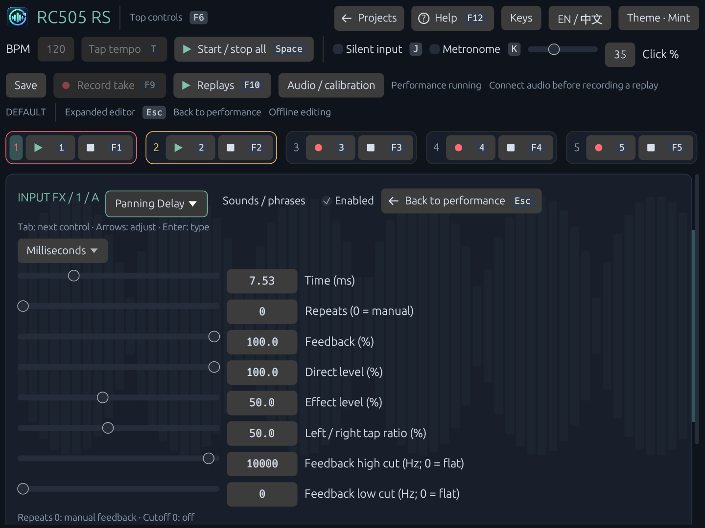
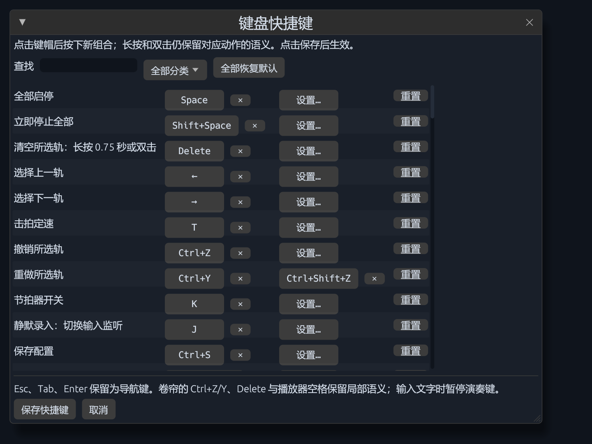
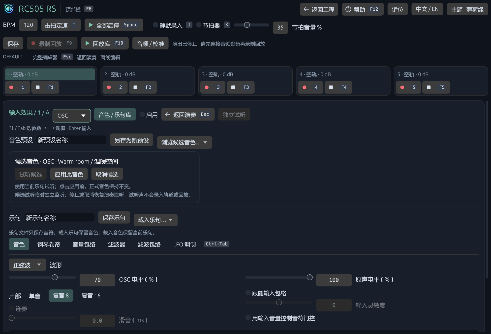
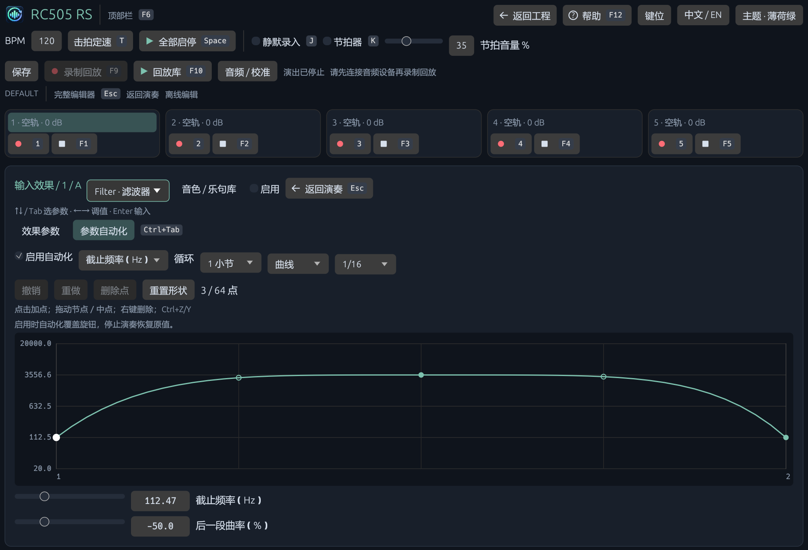
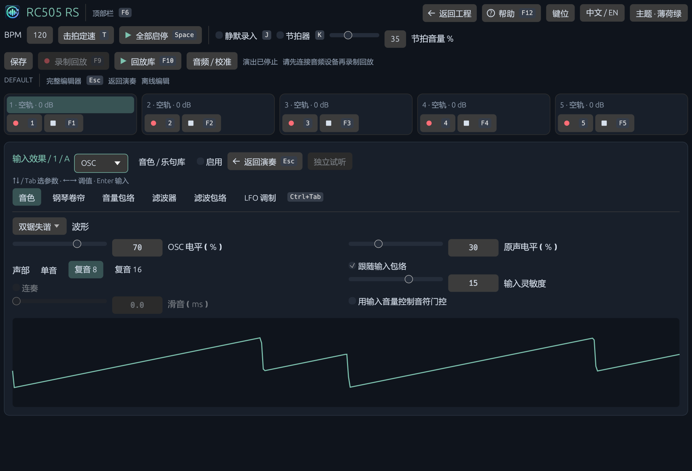

# RC505 RS 操作手册

适用于 Windows x64 的 0.4 系列；目前不支持 macOS 和 Linux。软件内默认按 **F12** 打开简明指南；安装说明见 [安装、迁移和更新](INSTALL_UPDATE_CN.md)。本文键名是默认值，可在顶部「键位」修改演奏/全局快捷键。

## 1. 安装、数据与工程选择

从 [Releases](https://github.com/Yishanka/RC505_RS/releases/latest) 下载安装包或便携 ZIP。程序目录、数据目录、下载目录分别可选；数据默认在程序旁的 `data` 中。升级保留数据。

启动后在后台检查新版，发现更新时提示，不会自动下载或安装。**F12 → 更新** 可手动检查，也可关闭启动检查。无网络时仍可正常使用。

安装版可通过 Windows「设置 → 应用 → 已安装的应用 → RC505 RS → 卸载」删除。**默认保留工程、音色、轨道音频与回放**；需要一并删除时，在卸载界面单独选择。便携版没有 Windows 卸载条目，删除程序文件即可；数据目录可独立保留。

程序启动停在工程选择页，只预选上次工程。单击列表选择，双击或 **Open project / Enter** 打开；上下或左右方向键切换。`N` 或 **+ New** 新建。**Rename** 改显示名称，不改变工程身份。**Manage → Move selected to Trash** 移入回收站；**Restore last deleted** 恢复最近删除的工程及资产。

已有工程打开前先验证 JSON、WAV 格式和 SHA-256，失败不会清空当前引擎后再尝试。工程以停止状态打开；换采样率时先在后台做 windowed-sinc 转换，不把旧音频直接按新速率播放。

可选 Audio setup 启动器只负责设备准备和打开主程序，工程管理统一在主程序内。发布包使用 Windows 系统音频后端。自行编译方式见 [README](../README_CN.md#源码与自行编译)。

## 2. 第一次录制

1. 打开工程，在左上 **Audio** 选择输入/输出，必要时点 **Reconnect**。调整设备或 buffer 前先停止全部轨道；重连保存内存快照并恢复到新设备。
2. 顶栏设置 BPM。正式演奏运行期间锁定 BPM；现有音频不做实时伸缩。
3. 按 `1` 或轨1 **Record** 开始录音，再按一次结束并循环。默认按 Beat 量化。开始和结束由音频采样时钟执行，QUEUED 表示正在等待边界或补偿尾部。
4. 播放时再按 `1` 进入 Overdub，再按一次结束。`Shift+1` 或 `F1` 停止轨1。
5. 点 FX 槽，在右上选择效果及参数，开启 **On / Enabled**；展开后可编辑钢琴卷帘、滤波曲线和包络。
6. `Ctrl+Shift+S` 保存参数及当前五轨音频；只想保留参数时用 `Ctrl+S`。

新录音会额外接收补偿尾部，并保持量化后的实际 loop 长度。录音过程中按 Stop 会结束录音并停止，不会丢弃整段内容。不要依靠 GUI 的动画位置判定采样精度。

## 3. 演奏布局、轨道模式和推子

顶部栏、两个快速面板、FX rack、五轨控件的位置固定。快速面板内部滚动；小窗口滚动整个工作区，不自动折叠/展开内容。左侧 Track / Audio / Session 分页分别提供轨道模式、硬件与校准、保存/回放/路由与电平。

### 焦点与键盘

**F6** 顶部栏，**F7** 左面板，**F8** 右面板。**上下**或 Tab / Shift+Tab 只选择控件，**左右**修改当前数值或枚举选项。小屏内自动滚动到所选参数，不移动整个演奏区。左右按住连续调整并逐渐加速；Enter 打开数值输入，再按 Enter 确认，Esc 取消。按钮用 Enter 操作，Space 保留全部启停。Esc 先退出当前面板焦点或完整编辑器，返回演奏界面；再按 Esc 返回工程选择页并提示保存。Alt+F4 关闭软件。

| FX 参数 | 左右键单次步长 |
|---|---:|
| 时间、起音/释音、滑音 | 1 ms |
| 增益、阈值、软拐点 | 0.5 dB |
| 百分比 | 1 个百分点 |
| 半音、音分、截止频率 | 1 半音、1 音分、1 Hz |
| 慢速调制频率、Q、压缩比 | 0.1 Hz、0.1、0.1 |
| LFO 拍同步周期 | 0.25 拍 |
| 包络曲率、元音位置 | 0.05 |

这些是演奏步长，不限制直接输入精度。例如 Delay 输入 7.53 ms 后，右键一次为 8.53 ms。卷帘画布获得焦点时，方向键仍按网格/半音移动音符；打开的下拉菜单和文本输入使用各自编辑规则。

**编辑 FX 时可以继续演奏**：`1–5` 录放、`F1–F5` 暂停、FX 开关、推子与逐轨撤销仍可用，编辑目标固定在原 bank/slot。方向键不会切换轨道，Delete 不会清轨；卷帘的选择、复制、删除和撤销组合键留给卷帘。文本输入、打开的下拉菜单、帮助、回放播放器和窗口失焦时暂停演奏键，避免输入数值时误录音。点击轨道标题仍可用鼠标选择演奏目标。

展开界面上方保留录放/暂停按钮和状态反馈。小窗口压成单行，轨号可选择轨道，右键可改录入参考；录音/叠录边框仍跟随节拍。图为离线界面示例。

0.2.6 移除了 A/D 重复入口。**F8 只选择效果编辑区，不负责返回或关闭**；完整编辑器中 F6 仍可选择顶部栏，F8 回到编辑区，F7 不切走页面。Ctrl+Tab / Ctrl+Shift+Tab 切换编辑器下一页/上一页。下拉菜单打开时先由菜单处理方向键和 Esc；文本编辑时上下键不抢走光标。状态行会显示当前 Esc 返回到哪里。

录音中显示红色、叠录中显示黄色四拍指示灯；当前拍亮点和轨道边框随节拍脉动。相位来自音频采样计数，不依赖界面帧率。

如果窗口仍发生无提示崩溃，可在所选数据目录查看 `logs/last-panic.log`。日志记录版本、错误和调用栈，不记录音频或整份工程配置。

| 操作 | 默认快捷键 |
|---|---|
| 轨1–5录音、播放、叠录、完成 | `1`–`5` |
| 停止对应轨 | `Shift+1`–`Shift+5` 或 `F1`–`F5` |
| 全部开始/停止；立即全部停止 | `Space`；`Shift+Space` |
| 选择轨道 | 点击标题、`← →`、`Ctrl+1`–`Ctrl+5` |
| 所选轨撤销/重做叠录 | `Ctrl+Z` / `Ctrl+Y`（或 Ctrl+Shift+Z） |
| 对应轨撤销 / 重做 | `Alt+1`–`Alt+5` / `Ctrl+Alt+1`–`Ctrl+Alt+5` |
| 清空所选轨 | 长按 `Delete` 0.75 秒，或在 350 ms 内双击 `Delete` |
| Input / Track FX 开关 | `Q W E R` / `U I O P` |
| 临时开启 FX，松键恢复 | 按住 `Shift+FX键` |
| 直接选择 FX bank | `Alt+FX键` |
| 选择 FX 槽并进入右面板 | `Ctrl+FX键` |
| 轨1–5音量下/上 | `Z X`、`C V`、`B N`、`M ,`、`. /` |
| 调整对应轨推子速度 | `Shift+该轨推子键` |
| 停止时 Tap tempo | `T` |
| 保存 config / config + snapshot | `Ctrl+S` / `Ctrl+Shift+S` |
| 开始/结束回放录制 | `F9` |
| 打开回放库 | `F10` |
| 内置指南 | `F12` |
| 静默录入 / 节拍器 | `J` / `K` |

输入文字、编辑音符、帮助/播放器、窗口失焦时不触发演奏键；临时 FX 失焦时恢复原状态。开关忽略系统自动重复。键盘自身的 rollover 仍可能限制某些多键组合；数字与字母键给出了 Fn 功能键不便时的替代方式。

演奏区可以一边用鼠标操作推子，一边使用演奏键。按钮或推子的普通键盘焦点不会停用演奏快捷键；真正进入数值/文字编辑、明确切到顶部或参数面板、打开编辑窗口时，按对应界面的键盘规则操作。同一按键已执行演奏命令后，不会再顺便改变聚焦的推子。

**Tap tempo**：第一拍只建立测量起点，不改变 BPM；第二拍直接按两拍间隔确定速度，之后平均最近 8 个间隔。停顿超过 3 秒或手动修改 BPM 后，从新一组拍点开始。同一帧内按 Tap 和开始时，先提交 Tap 的 BPM，再启动；开始操作入队后立即锁定 BPM，界面同时读回引擎实际采用值。

### 自定义键位

工程首页与演奏页顶部的 **键位** 打开配置窗口。可按分类/动作名称查找，点击键帽后按新组合；每个动作最多两个绑定，`×` 取消该绑定，「重置」恢复该动作，「全部恢复默认」恢复整套配置。冲突会显示双方动作，在解除冲突前不能保存；关闭或取消不应用草稿。

保存后全局生效，保存在数据目录的 `keyboard.json`，不随工程或回放改变。实际按钮键帽、推子提示和内置帮助同步显示新键位。长按/双击是动作本身的行为：将清空改为其他键后，仍要求长按0.75秒或350ms内双击；推子仍按时间连续运动，临时FX仍在松键时恢复。

Esc、Tab、Enter保留导航语义；操作系统的Alt+F4等组合不允许占用。钢琴卷帘里的Ctrl+Z/Y与Delete，以及回放播放器里的Space，是各自界面的固定编辑/播放键，不会被演奏配置覆盖。

### 静默录入

顶部 **静默录入**，默认 `J`，对应RC‑505mkII的 **INPUT THRU OFF**。输入和输入效果继续计算、正常录进轨道，只关闭它们直接送到输出的分支；已有轨道仍正常播放。再次按录放键结束录音后照常开始循环；要录完保持暂停，使用该轨停止键结束。

这个开关不会关闭声音设备，也不把录音音量改成零；主混响/压缩仍处理最终混音，独立试听与节拍器属于另外的监听分支。声卡自己的硬件直通不受软件开关控制。[官方参数手册，第12页](https://static.roland.com/assets/media/pdf/RC-505mk2_Parameter_eng04_W.pdf#page=12)

### 推子速度

每轨保存独立速度 **1–60 dB/s，默认24**，直接显示在该轨推子下。短按0.5 dB；按住180 ms后开始连续变化，在450 ms内从最高速度的1/4加速到最高速度。两方向同时按住抵消，松开即停止目标变化；音频端约5 ms平滑。

Shift + 推子键只改变该轨速度：短按1 dB/s，长按连续调整。Shift不再做精细音量调整。低速1 dB/s适合缓慢淡出，高速60 dB/s适合快速切换；每轨可同时采用不同速度。范围−60到0 dB，−60端点静音。鼠标也采用相同分贝刻度。

### 五轨模式

左侧 **Track** 编辑鼠标/键盘选中的音轨：

- **Reverse**：反向读取循环，保持采样长度和时钟同步；录音/叠录中不可切换，反向播放时不允许进入叠录。
- **One shot**：从起点播放一次后停止；播放键重触发起点，不进入叠录。
- **Stop Immediate / Loop end / Fade out**：立即停、到当前循环尾部停、按所设10–30000 ms淡出后停。等待停止时再按Stop立即停止；等待期间不接受新的Overdub。
- **Length**：0 bars手动完成；1–128 bars按4/4固定长度自动完成。实际音频上限为每轨5分钟；先达到限制时停止并显示提示。
- **Quantize Off / Beat / Measure / Loop**：立即执行、下一拍、下一小节、与运行中的参考loop边界对齐；无参考loop时Loop回退到一小节。第一条空轨会建立时钟。边界始终从采样起点计算，不逐拍累加舍入误差。
- **Undo/Redo**：每轨连续历史，覆盖首次录音、整轮叠录和清空。最多 8 步；每个撤销/重做栈按引用音频页限制到约 128 MiB，超限先丢最旧步骤，但至少保留最近一步，因此长录音可能少于 8 步。录音/叠录及补偿收尾中不能撤销，先结束录音。新编辑会清除重做分支。`Alt+1–5` 撤销、`Ctrl+Alt+1–5` 重做；所选轨也可 `Ctrl+Z / Ctrl+Y`。未使用 Alt+F1–F5，是因为 Alt+F4 会关闭 Windows 应用。快照保存历史；仅配置保存不保存新历史。

**录音对齐**可按轨选择：现场人声/乐器选「现场输入」，录OSC乐句选「内部音源」。前者补偿声卡回环、输入FX和已知的监听对齐延迟；后者只补偿输入FX，不扣声卡回环。左面板可选，展开编辑器也可右键五轨条的轨号修改。录音、叠录与收尾时锁定本次参考；若要同时叠加内部与外部音源，建议分轮录入，混合后的非线性FX输出无法再分别对齐两种来源。

音轨状态及播放位置读取引擎快照。UI不再定时强行修正播放游标。

## 4. 两层效果与两级编辑界面

每层包含 **4 个 bank × 4 个槽位**。Input FX 与 Track FX 独立选择活动 bank；只有该层当前活动 bank 参与处理。

- 点击槽位名称：在右上方快速面板编辑该槽。
- 点击 **On / Enabled**：启用效果。Input FX 是全局输入开关；Track FX 开关属于当前所选音轨。
- 在快速面板选择效果类型，拖动滑条或点击数值输入。
- 点击 **Expand editor**：进入完整工作区；点击 **Back to performance** 或 `Esc` 返回。
- **OSC** 可直接点击「打开钢琴卷帘」。MyDelay 已合并为 OSC 的采样波形/采样音色。
- 改效果类型会重置声音参数；原 OSC 乐句会停放在槽位上，切回 OSC 可继续编辑。先保存音色预设可保留旧声音。

编辑目标包含 bank 和槽位，展开后不会因其他 bank 被选中而误改另一个槽。若正在编辑的 bank 不活动，界面会提示并提供 **Activate this bank**。

完整工作区按模块提供音色、钢琴卷帘、音量包络、内部滤波、滤波包络和 LFO 调制页。顶部「音色 / 乐句库」按钮展开素材管理；默认收起，为编辑器保留空间。其他效果直接显示其全部现有参数。参数实时更新同一份配置，返回演奏台无需再点击 Apply。

**浏览音色先进入候选状态。** 素材库中选择预设只显示候选，不改变正式工程或扬声器声音。点击「试听候选」才临时切换为独立监听；「停止候选试听」或「取消候选」恢复正常演奏监听。OSC 使用当前乐句，空乐句则只发一个 C4 短音；普通 Input FX 使用实时输入，Track FX 使用所选轨已有音频，不伪装成旋律／序列试听。正式引擎和轨道录入继续走原来的效果链，候选声不会录入轨道；录制回放、回放播放和回环校准期间不可开始候选试听。点击「应用此音色」才替换正式音色，保留当前乐句、链接、待切换请求和槽位启停状态；可不试听直接应用。关闭素材库、离开完整编辑器或选择其他编辑对象会取消候选。选择候选时保存其内容，试听后即使磁盘文件发生变化，应用的仍是同一份音色。

### Filter、Delay、Reverb 参数自动化

展开这三类效果后，选择 **参数自动化** 页；快速面板也有「打开参数自动化」。每槽最多一条参数轨，点击「创建参数轨」，选目标、循环长度和插值方式，再开启「启用自动化」。普通界面与展开页共用同一配置。

| 效果 | 可自动化参数与范围 |
|---|---|
| Input / Track Filter | 截止 20～20000 Hz；Q 0.1～10 |
| Delay / Panning Delay | 时间 1～2000 ms；反馈 0～100%；效果电平 0～120% |
| 原生 Input Reverb | 衰减 100～12000 ms；独立湿声电平 0～100%，不改干声 |
| Audio Reverb（含 Track） | 衰减 100～15000 ms；干湿 Mix 0～100% |

点击图形空白添加点，拖动节点调整时间／值；右键或 Delete 删除内部点，起止点保留。**步进**保持每段起点值；**线性**沿纵轴刻度连接；**曲线**可拖动段中间的小圆环，或调下方曲率。频率、Q、时间和衰减使用对数纵轴，百分比用线性纵轴；数值显示真实单位。节点可用方向键移动（左右按网格、上下按纵轴1%）；下方数值控件按左右微调，毫秒／Hz／百分比每步1，Q每步0.1，Enter可直接输入。Ctrl+Z/Y或按钮提供64步局部撤销／重做，历史不写入工程。

每轨最多64点、960 PPQ，常用周期1～8个四拍小节；修改周期会按比例缩放点位。导入的非整小节周期显示实际拍数，不偷偷按小节取整。正式演奏开始后，以该效果的 **PDC 来源时钟** 循环；独立试听使用自己的时钟。停止或禁用时回到原旋钮值。Filter 截止自动化替代基础截止，既有扫频和轨道滤波包络继续作用；Delay 时间／反馈自动化在启用期间覆盖拍同步时间／重复次数对应的基础值，关闭后恢复。原有参数平滑仍生效。

参数轨随工程、单槽音色预设和采样精度操作回放保存；不修改音符乐句。切换到不兼容效果时自动禁用但保留曲线，切回后可手动启用。不同 Reverb 实现按自身范围保存，避免越界。此功能是一槽一条有界曲线，没有全参数调制矩阵或 Playlist。

## 5. 用钢琴卷帘写旋律与和弦

Input FX A 选择 **OSC** → 展开 → 钢琴卷帘 →「乐句操作 / 初始旋律」→「独立试听」。从音色页选 **复音 8 / 复音 16**，在同一时间的 C、E、G 三行各放一个音符，就能演奏和弦。单音模式只改变播放策略，不删除和弦数据；切回复音后和弦仍在。

**试听与正式演奏独立。** 试听使用自己的时钟，忽略槽位 Enabled 和输入门控，只送监听，不进入轨道或回放。OSC 需要有音符；采样模式还需要导入或捕获素材。Track Filter 的步进试听需要所选轨已有音频。普通音频效果没有「旋律试听」按钮。切换编辑目标或开始回放录制会停止试听。

正式演奏须开启槽位，再启动节拍器、全部开始或轨道录放。正式时钟未开始时 OSC 不生成固定长音；停止后释放尾音自然结束。OSC 默认按音符发声；只有主动打开「用输入音量控制音符门控」后，Threshold 才参与音符发声条件。采样捕获与音符触发是两个独立动作。

| 操作 | 结果 |
|---|---|
| 左击空白网格 | 插入当前 Snap 长度的音符；可与其他音高重叠 |
| 左击音符 / 左侧琴键 | 选中音符并短暂试听该音高；「试听」可关闭点击发声。已有整段试听会被此单音试听替换 |
| 框选工具拖动空白 / Shift+拖动空白 | 框选 / 追加框选；Shift+点击音符切换其选中状态 |
| Ctrl+点击 | 即使该位置已有同音高音符，也创建独立的重叠音符 |
| 拖动主体 / Ctrl+拖动 | 一起移动所选音符 / 复制并移动所选音符，保留音程与间距 |
| 拖动右边缘 | 调整该音符长度，保持循环边界 |
| 右击音符 / Delete | 删除所选音符；右击未选中的音符只删除该音符 |
| Ctrl+A / Ctrl+C / Ctrl+X / Ctrl+V / Ctrl+D | 全选 / 复制 / 剪切 / 在编辑光标处粘贴 / 紧接选区复制；空间不足时提示，先手动增大小节数 |
| 方向键 / Shift+方向键 | 按网格左右移动、按半音上下移动 / 按一拍左右移动、按八度上下移动；焦点须在卷帘 |
| 属性 | 展开所选音符属性；起点与力度作用于整个选区，时长作用于主选音符 |
| Ctrl+Z / Ctrl+Y | 撤销/重做音符、长度或载入乐句，最多 64 步 |
| 乐句操作 / 复制乐句、粘贴 | 复制整个循环（含休止）到其他槽，声音不变 |
| 乐句操作 / Duplicate | 连同休止复制到右侧，循环长度翻倍 |
| 乐句操作 / −12、−1、+1、+12 | 按半音移调选区；未选择时移调整段 |
| 乐句操作 / Clear notes | 清空音符，保留循环时长 |
| Bars | 明确设置 1–8 小节；缩短会裁切，支持撤销 |
| 定位八度 / Zoom | 定位 C0–B9、缩放时间轴 |
| 滚轮 / Shift+滚轮 | 上下音高 / 左右时间 |
| 中键拖动 | 平移视口，不修改音符 |
| 适配时间轴 | 显示整段循环并定位到音符所在音区 |

每条乐句最多 2048 个独立音符。音符用 ID 区分，同音高重叠的松键不会把其他同音一起关掉。循环末尾截断越界音符，不因添加/删除/拖动音符而偷偷延长循环。声部满时按释放状态、输出强弱和年龄确定替换顺序，并做短过渡；正式演奏最多同时处理 4 个 OSC × 16 声部，独立试听另有最多 16 声部。

内部使用 **960 PPQ**，即每四分音符 960 个整数刻度。可选 1/4～1/64、三连音或自由网格；选中音符后可精确输入以拍为单位的起点和时长。旧版每拍 12 格的数据按 ×80 精确迁移，原时长不变。时间由音频时钟换算，不逐格累加四舍五入误差。最长仍是 8 个四拍小节。

单音试听使用当前声音的音高、力度与包络，按下约 250 ms 后自然释放；不需要已有乐句，也不启动正式时钟或录入轨道。回放录制、回放播放、延迟测量及离线预览期间不可启动单音试听。采样模式仍需有效采样素材。

「音色 / 乐句库」中有两个独立区域：**音色预设**只保存声音，**乐句**只保存音符/力度/循环长度。载入音色保留当前旋律，载入乐句保留声音。素材库文件是副本，不随当前编辑改写原文件；不提供组合预设。音符历史不写入工程，切换编辑目标或重开工程开始新历史。

**下一轮切换**默认开启。正在运行且启用的声源载入乐句时，旧乐句继续到自己的下一循环边界，新乐句从第一个音开始；其他声源不重置。界面显示待切换乐句，可「立即切换」或「取消待切换」。停止或旁路的声源新载入时直接生效。已经排队后若停止，队列保留，重新启动后等旧乐句完整一轮再换；保存工程和回放也保存待切换请求。更换为非音源效果会保留当前乐句并取消其待切换请求。

**声源 / 链接**展开简洁的声源列表。选择来源后「复制它的乐句」得到独立副本；「链接并共享编辑」才共享后续音符、力度、循环长度与名称，声音参数仍独立。组内任一声源的编辑会同步给组内其他声源，普通音符修改保持各自播放相位。载入新乐句按每个运行声源自己的边界切换；取消待切换会取消同组队列。「解除当前链接」保留独立副本。声源移动槽位后身份与乐句跟随；切到非音源时仍在列表标为「未连接」。没有 Playlist 或复杂场景编排。

编辑器按能力区分：OSC 用音符钢琴卷帘；Transpose 用 **±12 半音控制序列**，处理已有音频；Step Slicer / Track Filter 用门控步进序列。五条录音轨仍是音频，不会因打开卷帘就变成可拆分的 MIDI 音符。

## 6. 现有效果参数

### OSC：统一合成与采样音源

| 参数 | 范围；新音色默认 | 说明 |
|---|---|---|
| 波形 | 正弦 / 锯齿 / 方波 / 三角 / 人声 / 采样 / RECT / 双锯失谐 / 暖化锯齿；默认正弦 | RECT为25%占空比；双锯分别偏移±7音分；暖化锯齿减弱高次谐波。三者是软件定义，并非BOSS原波形数据 |
| Level | 0–100；70 | 输出音量，复音使用固定余量，不随当前按住几个音突然改变已有音量 |
| 声部 | 单音 / 复音 8 / 复音 16；8 | 每声部有独立相位、力度、音量包络和滤波状态 |
| 连奏 | 默认关闭；仅单音 | 重叠音符保持包络和 LFO 相位，最后按下音优先 |
| 滑音 | 0–2000 ms；0 | 仅单音；按半音距离平滑连接音高，0 为立即切换 |
| 滑音方式 | 重叠音符 / 所有音符；重叠 | 前者只连接有重叠的音符；后者也连接断奏，首次起音不滑 |
| 输入门控 | 默认关闭 | 打开后才要求输入强度超过 Threshold |
| 原声电平 | 0–100%；默认100 | 独立调整OSC所在处理链的干声；OSC电平调整生成声音 |
| 跟随输入包络 / 灵敏度 | 默认关闭；开启后−50～50 | 根据实时输入音量连续调制OSC音量，保留乐句触发和AHDSR；不同于门限开关 |
| Threshold | 0–100；10 | 归一化振幅百分比，不是 dB；捕获输入同样使用该阈值 |
| 人声波形 A → I | 0–1 | 合成的元音谐波形状，不是人声录音或硬件 OSC BOT 的声学复刻 |

只听合成音时，把「原声电平」降到0；需要人声与合成音叠加时，分别调原声与OSC电平。A→D路由按每个槽位混合：当前槽的原声包含前面的处理结果。Legacy路由中多个OSC仍并行混合，各槽原声电平的乘积只作用于原始输入，后一个OSC的原声电平不会压低前一个OSC的湿声。

「跟随输入包络」开启后，轻声输入产生较轻的OSC，响声输入产生较强的OSC；灵敏度越高，小输入也越容易达到完整音量。这里采用软件定义：0对应约−12dBFS输入峰值达到完整音量，−50～50对应±24dB包络增益，并使用约5ms时间常数平滑。它不会在没有音符或停止演奏时自行发声。独立音符／乐句试听忽略输入跟随和输入门限，可以直接调音；正式演奏才按实时输入驱动。

OSC 集成音量包络、滤波器、滤波包络和两个独立 LFO。内部滤波默认 Mix=0、截止8000 Hz，可调整20–20000 Hz；需要时打开，独立 Input Filter 仍可同时使用。Reverb、Dynamics 等效果使用独立机架槽位。

OSC 小面板直接提供 **捕获音色**，无需展开或先切换波形；捕获完成后自动选择「采样」。等待输入时可点 **取消捕获**。在展开界面可调整捕获时长、采样区域，或导入/拖入 WAV。

导入/分析在工作线程执行；支持 8–192 kHz、整数或浮点 WAV，最多使用前 2 秒，转成有抗混叠滤波的 48 kHz 单声道素材。捕获时长 20–2000 ms，等待当前效果组输入超过阈值后录入；不要求先开始正式演奏，也不会自动生成音符。非活动效果组需要先激活。

**新采样默认临时使用。** 在完整音色页填入名称，点击 **保存为音色** 才保留；音色库原有的「保存为新音色」也有同样作用。仅保存工程配置、保存轨道音频快照都不会暗中保存临时采样；退出后它会丢弃。保存配置不会打断当前会话里的声音。已经存入旧工程的采样继续保留。

音色预设自带采样，工程保存预设引用、校验信息和当前参数，不重复嵌入该PCM，也不依赖原始导入WAV路径。再次打开工程时只从预设取回素材，起止位置、包络等采用退出前保存的工程值。重新捕获／导入会变为新的临时素材，旧音色不被覆盖。预设缺失或被外部修改时显示提示，可移除引用或重新载入／另存音色。

演奏中更换或重新捕获采样后，**之后触发的音符使用新素材**；已经发声或正在释放的音符继续用原素材及原采样区间、根音和循环设置，直到结束。单音连奏切到新的音符时采用新素材，并保留连奏包络。采样仍为最多2秒的单声道素材；这个修复没有改变导入上限。

- **采样波形**：自动选择检测到的稳定周期，再按归一化相位演奏。可用起点/终点调整、点击「选择检测到的周期」恢复分析结果。没有稳定基频时先选择一个短片段，并显示提示。使用分数相位和带限波表，不再用 `round(sample_rate / frequency)` 的整数周期。
- **采样音色**：保留整段时间纹理，按「素材原音高」与音分微调进行重奏。检测到基频时自动填入原音高；可选择按住循环或一次播放。升调使用预先生成的低通采样层，减少混叠；不是实时人声共振峰保持算法。
- 切换两种模式会选择相应的默认区域。波形图显示素材及所选边界；保留素材需要明确保存为音色。

捕获和导入只在素材准备好、常规配置命令被音频线程接收后改变发声，回放记录同一时刻的素材版本；旧声部保留其素材到释放结束。

### AHDSR 包络与 LFO

单音 Bass 滑音示例：先把相邻两个音符的尾部/头部重叠，选择「单音」，打开「连奏」，把「滑音」设为 80 ms。第二个音会从当前音高滑过去；松开高优先音时，会连奏返回仍按住的前一个音。仅首尾相接、没有重叠的音符仍重新起音；「所有音符」模式可让断奏之间也滑音。切回复音保留设置，但不应用连奏或滑音。滑音时长在换音时确定；调为 0 会立即到达目标音高。连奏也保持采样读头，一次性素材播完后可松开再起音，或开启采样循环。

新音色默认 Attack=5 ms、Hold=0、Decay=150 ms、Sustain=75%、Release=100 ms、Start=0。范围分别为 A 0–2000、H 0–5000、D 0–10000、R 1–5000 ms，S/Start 为 0–100%。

包络图与参数同步：横拖 A/H/D/R 节点改时间，竖拖 Start/S 改电平；拖动小中点改变曲率，双击中点恢复直线。下方滑条可精确调整。Attack 从 Start 到峰值、Hold 保持、Decay 到 Sustain，松键后 Release 回零。图中的 Off 是参考松键位置，不是声卡波形。旧工程的陡峭 Tension 值保留；触碰新曲率控件会转为新范围，界面会提示。

包络使用**固定时间视窗**：默认 1 秒，可选择 100 ms、500 ms、1 s、5 s、30 s，通过箭头或「视窗起点」平移。修改参数、拖节点以及松开鼠标都不会自动缩放或回中；若节点超出视窗，手动换范围或平移即可。音量包络和滤波包络各保留自己的视窗；这些是界面状态，不改变声音。

**LFO 调制页**有 LFO 1 / LFO 2 两个编辑页，分别启用、设波形、速率、相位方式和目标。切换编辑页不停止或重置另一条 LFO：

| 设置 | 含义 |
|---|---|
| 波形 | 正弦、三角、斜坡、方波或自绘曲线 |
| 自绘曲线 | 双击加点，拖节点改形状，拖小中点改曲率，右键删除内部节点；最多 32 点 |
| 运行 | 自由相位，或起音时重新开始；单音连奏保留相位 |
| 速度 | 跟随节拍的 1/16～32 拍周期，或 0.01–40 Hz |
| 目标 | 音量、滤波 cutoff，或最大 ±12 半音的音高调制 |
| 深度 | 每条 0–100%，默认 50%；两条均默认关闭 |

两条可作用于不同目标，也可叠加到同一目标：音量相乘且不额外放大；音高按半音相加，每条最多 ±12 半音，两条合计最多 ±24 半音；cutoff 按对数频率合成后限制到可用范围。截止调制需要内部滤波 Mix 大于 0。音量调制乘在包络之后，包络结束后仍保持静音。两条 LFO、连奏和滑音设置都属于音色预设，旋律音符属于乐句。旧文件保留原 LFO 作为 LFO 1，新增 LFO 2 默认关闭，连奏关闭、滑音为 0；默认声音不因升级改变。

### Filter

| 参数 | 范围；默认 | 说明 |
|---|---|---|
| Type | LPF / HPF / BPF / Notch；LPF | 低通、高通、带通、陷波 |
| Cutoff | 20–20000 Hz；1000 | 对数滑条 |
| Q (×0.1) | 1–100；7 | 对应实际 Q=0.1–10.0，默认 0.7 |
| Drive | 0–100%；0 | 混入归一化 tanh 饱和；0 为线性 |
| Mix | 0–100%；100 | 干湿线性混合 |

cutoff 和 Q 有约 20 ms 平滑。可拖动响应图：横向调整截止频率，纵向调整 Q。0.3 使用适合连续调制的 TPT 状态变量滤波；曲线计算其等价的线性传递函数，参考采样率固定为 48 kHz。图示包含干湿相位叠加，不包含非线性 Drive 或包络运动。

独立 Input/Track Filter 还提供 **Sweep / 扫频**。深度 0 表示关闭；增大后截止频率围绕基础值上下运动，100% 为 ±4 个八度（到达可用频率边界会截住）。速率选择 Hz 或每周期拍数；自由 Hz 在未开始演奏时也可以调音，拍同步在演奏停止时回到基础截止。打开「阶梯」后，截止按 Step Rate 的频率或拍间隔保持一格，再跳到下一格。滤波器本身仍会平滑突变。响应图显示基础截止，暂不追踪动态扫频。

OSC 内部滤波包络在对数频率域把 cutoff 从 20 Hz 调制到所设上限。Track Filter 另外提供可视 step gate：Append step、Remove last，点击 step 方块开关整段门限；展开 Cutoff envelope 调整包络。时间基准跟随本轨播放位置。

### 旧 MyDelay 的迁移

新建效果列表不再单列 MyDelay。打开旧工程时，其乐句、音量、阈值、包络和滤波设置迁到 **OSC / 采样波形**。旧 JSON 从未保存当时捕获的 PCM，因此无法凭空还原那段素材，需要重新捕获或导入 WAV；已录轨道的音频快照仍保留。此合并有意更新声音算法，不承诺旧工程或 renderer 2/3 的 MyDelay 逐位同音。

### Reverb

| 参数 | 范围；默认 | 说明 |
|---|---|---|
| Size | 0–100；50 | 映射延迟线基本长度约20–120ms |
| Decay | 100–12000 ms；2500 | RT60 衰减时间 |
| PreDelay | 0–500 ms；20 | 预延迟，0直接进入扩散器 |
| Width | 0–100%；70 | 立体声宽度 |
| HighCut | 0–20000 Hz；13350 | 0 为 FLAT；旧百分比按原映射转换 |
| LowCut | 0–12500 Hz；120 | 0 为 FLAT；低频清理 |
| Direct / Effect level | 0–100%；100 / 35 | 独立干声、湿声电平 |
| Density | 1–10；5 | 输入全通扩散量，1关闭扩散 |

采用输入全通扩散器和4线FDN。展开界面提供干湿电平、密度和阻尼。旧工程缺少新增字段时，按 Direct=100、Effect=35、Density=1 导入，保留旧固定混合比例和无扩散的行为。旧HighCut百分比按原先18000–2500 Hz线性映射迁移为明确的Hz值；Size、Width及12秒上限属于软件实现。

现在也可以选择 **Track FX / Reverb**，或在音频页打开主混响。Track 与主混响使用相同 FDN 核心；其紧凑面板用干湿比例控制，展开后同样提供密度、0–500 ms 预延迟、高低切和宽度，衰减上限扩展到 15 秒。

### Vocoder

| 参数 | 范围；默认 |
|---|---|
| Carrier | Tr1–Tr5、Input L、Input R；Tr1 |
| Bands | 4–16；10 |
| Attack | 0–200 ms；6 |
| Release | 0–1000 ms；80 |
| Level / Mix | 0–100%；100 / 100 |
| Tone | −50到50；0，调节频谱倾斜 |
| Mod sensitivity | −50到50；0，映射为包络检测前±18 dB灵敏度 |
| Formant | −12到12半音；0，移动频谱包络，保留载波音高 |
| Sibilance | 0–100；20，增强高频分析带，不注入噪声 |
| Carrier thru | Off / On；Off，只对输入载波有效 |

先在一条轨道录制有谐波的合成器/人声等载波，再用输入调制它。载波太接近纯正弦时，口型塑形会很弱。当前载波来自 Track FX 后、音轨推子前；暂停的载波轨在全局时钟运行时可继续向 Vocoder 提供信号，不播放其干声。载波轨为空时没有对应湿声。

选择 Input L 时：将载波送入左通道、语音送入右通道；Input R 则相反。使用的是一个立体声输入设备，不是硬件的多组独立 MIC/INST 接口。Carrier thru 控制载波所在通道的干声是否参与 Mix；Mix=100时输出纯湿声。

滤波器组现在缓存系数，使用独立立体声合成通道；保留并调整此前“共振峰对比度增强”的思路，按整个频谱包络归一化，避免逐带削平。Formant、Bands、Release、Sibilance 是软件提供的扩展；Attack 仍使用毫秒而非硬件0–100刻度。没有实机 A/B 录音，不能把这些参数称为已经完成硬件声学标定。

**Track FX / Vocoder** 以当前轨道作为人声／调制信号。载波可选实时输入左／右声道，或另一条轨道的 **FX 前**信号；五轨使用同一帧的快照，不因处理顺序产生自反馈。它与 Input Vocoder 原有的 FX 后载波语义有明确区别。载波为空时，100% 湿声保持静音；实时载波的直接监听由顶部「静默录入／Input Thru」决定。

### Input / Track Delay 与 Panning Delay

Input 和 Track 的普通 Delay 共用一个核心。时间 **1–2000 ms**，默认 320 ms；直接电平 0–100%，效果电平 0–120%，新效果默认 100% / 50%。高切 0–20000 Hz、低切 0–12500 Hz；0 为 FLAT。时间、反馈、阻尼、电平约 25 ms 平滑；移动延迟时间会产生滑音，这是效果本身的声音变化。

重复次数 **1–16**，默认 8；选择 **0** 显示手动反馈系数 **0–100%**，100% 为单位反馈。启用切频时回声仍会改变频谱，持续输入也可能积累到输出上限。次数模式按“到该次回声衰减至 −60 dB”换算。普通 Delay 与 Panning Delay 可输入 **0.01 ms** 精度，左右键单次调整 **1 ms**；旧 JSON 的整数毫秒可正常读取。旧工程未保存重复次数时继续采用原手动反馈，旧 Mix 仍迁移为 Direct=100−Mix、Effect=Mix。

100% 不会暗中降为 99%。此时分数毫秒的回授使用全通插值，避免短回声每次插值都悄悄衰减；固定时间、FLAT 切频和低电平输入下可以持续保持。改变时间会滑音并重排波形，切频与保护限幅仍会改变音色和能量。接近满反馈时建议先降低效果电平，再调整短延迟的音高。

**Panning Delay**：先把耳机戴好，将时间设为 400 ms、左／右时间比设为 50%，打一声短拍手。左边约 200 ms 后回响，右边约 400 ms 后回响，之后继续循环。普通 Delay 保持原来的左右通道，不主动分配先左后右的回声。Panning 的宽度 0 把这些抽头折到中间，1 保持完整声像。

同步选项把音符时值换成毫秒。缓冲仍有 2 秒上限；例如 60 BPM 的一小节需要 4 秒，界面会明确提示实际限制为 2000 ms，而不会默默承诺 4 秒。

### Input / Track Roll

| 参数 | 作用 |
|---|---|
| Mode | Roll 1：反馈衰减；Roll 2：重复次数 |
| Base cycle / Time | 毫秒1–1000，或与Delay相同的五种节拍值；默认1/4音符 |
| Step | Off、1/2、1/4、1/8、1/16；默认1/4 |
| Feedback | 1–100%；默认50，仅Roll1且Step=Off时生效 |
| Repeat | 1–100次；0代表无限，默认0；仅Roll2且Step=Off时生效 |
| Balance | 干湿0–100%；默认100 |

两类机架共用 Roll 参数与算法。旁路时持续保留最近的立体声输入，开启时冻结其中一段，**包含此前槽位效果的输出**。Input Roll 在 A→D 路由中精确处理该槽前级；旧 Legacy 路由则明确放在全部固定分组与新增 Audio FX 之后。Step分割的是Base cycle；在120 BPM、Base=1/4音符、Step=1/4时，循环片段为125ms。Step=Off只是关闭细分，仍保留整个基础周期的重复效果，不等于旁路。

Roll1按每次循环衰减，Feedback=100无限保持；Roll2按指定次数播放后回到干声。细分开启时持续重复，忽略Feedback/Repeat。开关混合约5ms平滑，片段接缝有短交叉淡化。重新关闭/开启可重新捕获；修改 Base cycle 也会重新收集声音。只修改 Step 则继续用同一份冻结音频，可来回切换 1/2、1/4、1/8、1/16 与 Off，并重新计算有限重复的计数。新 bank 或没有足够历史时，先输出干声并等待收满一个完整 Base cycle。缓存最长2秒。

旧工程Step=2/4/8仍可载入，但从“整条loop分段叠加”改成单片段冻结后，听感有意改变。Roll1反馈曲线、重复边界和硬件的精确瞬态仍需实机标定。

### 新增音频效果：先选要处理的声音，再选效果

这些效果可以放在 Input FX 或 Track FX。Input FX 处理录入的声音；Track FX 处理已录循环。先选择槽位类型，启用槽位，再展开调参数。**效果需要已有音频，不会自己生成旋律**。

| 想做什么 | 选择与起点 |
|---|---|
| 把整段 loop 升高／降低 | Transpose：设置 −12～+12 半音；循环时长不变 |
| 让音高随拍子切换 | Transpose → 半音控制序列：勾选启用、选步数／时值、拖画每步的相对半音；演出停止时回到基础值 |
| 人声“电音跳格” | Electric：选调式与主音，校音过渡设 0–10 ms，输入单独一条清晰人声 |
| 自动加三度等和声 | Harmonist：选主音／大调或小调，和声音程 +3，调和声音量；C 大调中 C→E、D→F |
| 强化低音 | Octave：混入低一、低两八度，保留适当原声 |
| 失真与粗糙音色 | Distortion：Vocal／Boost／OD／DS／Metal／Fuzz六风格，逐步增加驱动；原声与效果音量独立，旧预设保留旧版风格 |
| 控制响度、压住峰值 | Dynamics：十九软件配方与压缩强度，或自定义压缩／限幅／噪声门；Sustainer 是更偏延音的压缩起点 |
| 定位频段 | EQ：拖动三个点，横向调频率、纵向调增益；中频 Q 控制宽窄 |
| 左右运动、宽度 | Auto Pan 自动移动；Manual Pan 手动平衡；Stereo Enhance 可给单声道生成侧声道；Width 为 0 时合并单声道，1 为原宽度比例 |
| 周期性变化 | Tremolo 改音量，Vibrato 改音高；可选自由 Hz 或拍同步 |
| 流动／增厚 | Phaser、Flanger、Chorus；从低深度、少量混合开始 |
| 按步切断／恢复声音 | Step Slicer：选 1～16 步，拖画每步音量，深度控制切分强度 |
| 保持当前声音纹理 | Freeze：打开保持，调整渐入／渐出与持续电平；它延续短纹理，Roll 则按拍重复短循环 |

EQ 有低频、低中频、高中频、高频四段；两个中频可以分别调整频率、增益和 Q。Phaser 提供 4/8/12 级，6 级用于保留旧音色；中心调整扫频位置。Flanger 的中心调整短延迟的范围。两者反馈上限85%。Chorus 的低切/高切只影响湿声，0 表示不过滤；保留原始干声时可先加大 Mix 试听过滤效果。

DIST的新六风格有实际不同的滤波／失真结构。Dynamics的十九项是公开配方的软件风格，正的压缩强度值会增加压缩；切回“自定义”恢复此前手动参数。两者均未宣称BOSS实机等效。操作、算法差别和全部配方见 [DIST 与 Dynamics](DIST_DYNAMICS_CN.md)。

Phaser、Flanger、Auto Pan、Tremolo 的「阶梯」会将运动按固定间隔保持一格；间隔可用 Hz 或拍数。Auto Pan/Tremolo 另有波形尖锐度、0–180°相位与「开启时重置相位」：重置开启时从设定相位起步，关闭时偏移共同拍相位。形状越陡，左右声像或音量变化越突然。旧音色保持原正弦连续运动，新建 Auto Pan 默认启用相位重置。

Sustainer 的低频/高频音色各可调 ±20dB，位于压缩之后。Step Slicer 的「门宽」决定每格中发声的比例，例如25%表示前四分之一发声、后面关闭；Depth较小时仍保留部分原声。可选压缩位于切片之前，用阈值决定开始压缩的电平、补偿增益调整输出。门宽默认100%、压缩默认关闭。

**Stereo Enhance** 新建时开启「拓宽单声道」：从中声道的中高频生成少量左右差异，适合给居中的人声或音色增加宽度；「拓宽强度」0～1 控制生成量，Width 控制总体侧声道比例。生成路径固定用 200 Hz 四阶低切保护低音中心，原始中声道保持即时通过。可选「侧声道低切／高切」作用于最终侧声道，0 为关闭，其余范围 20 Hz～12.5 kHz；它们不改变中声道。输出以 M+S / M−S 重组，在未削波时合并单声道可恢复原中声道。旧工程和音色的拓宽开关默认关闭，保留此前的中侧宽度算法。官方手册确认的是单声道拓宽与低／高切、Enhance 控制；本软件的短全通去相关与低音保护是自研实现，未做硬件听感等效承诺。[官方参数第39页](https://static.roland.com/assets/media/pdf/RC-505mk2_Parameter_eng04_W.pdf#page=39)

**音高效果有算法延迟。** 在 48 kHz 下 Transpose、Electric、Harmonist、Octave 的窗口延迟约 42.65 ms；展开界面显示当前采样率下的帧数和毫秒。音频页可开启 **PDC／效果延迟对齐**，让五轨、输入监听与节拍器保持相同时间。新工程默认开启，旧工程保持原开关。开启后，已配置的音高槽即使暂时关闭，也保留窗口延迟，避免开关时改变拍点。串联越多，整体监听等待越长；声卡回环测量不能消除这个处理窗口。详见下方「录音对齐与 PDC」。

四类音高效果均可开启 **共振峰保持**：升降调时尽量保留元音的声道特征，再用 ±12 半音偏移把声道调得更亮／更深。新建 Electric／Harmonist 默认开启，旧预设保持关闭；稀疏纯音会自动回退为普通移调。Electric／Harmonist 仍用于单声部输入，不能同时校准混合和弦或多人声；大音程、呼吸音和快速辅音可能有瑕疵。移调会软化瞬态，尚未做硬件音色等效标定。算法与性能说明见 [FX 实现说明](FX_IMPLEMENTATION_CN.md)。

### 主压缩与主混响

顶部「音频／校准」→「主输出效果」，可分别启用 **主压缩**、**主混响**。点击「调整主输出效果」进入独立编辑窗口，在上方切换压缩和混响页；`Esc` 关闭窗口，回到演奏界面。

主效果作用于五轨推子后的总混音和正在监听的输入，按 **主压缩 → 主混响** 排列，默认关闭。它们影响听到的声音和回放导出，**不会写入轨道录音**；节拍器也不进入这两个主效果。想保留未染色的 loop、只给整场演出加一点空间时，使用主混响。内部录音保留浮点余量，输出过大时可降低推子或主输出增益，不必重新录制已经被中间机架截平的波形。

## 7. 保存、回放与预设

### 两种工程保存

**Save → Configuration / Ctrl+S** 保存BPM、序列、所有FX、开关、五轨音量、模式和推子速度，保留此前的音频snapshot引用。它不会把当前新录音悄悄当成已保存。

**Save → Configuration + audio / Ctrl+Shift+S** 保存请求被引擎接收时的五轨音频与Undo状态、当前config。共享音频页在后续写入时复制，后台写WAV与清单；保存期间仍可演奏。只有全部写入、刷盘完成才更新工程指针。旧snapshot保留，可用备份JSON中的引用恢复，不自动清理。

音频为立体声32-bit float WAV，不做有损编码。每个文件有帧数和SHA-256。损坏或缺失的资产会阻止打开，不用静音代替。工程JSON保存前保留 `.json.bak`；索引缺失/损坏时优先恢复备份，再扫描有效工程。只读第二实例不可保存或删除，避免两个编辑器相互覆盖。

关闭窗口或回工程页会询问保存config+audio、仅config、丢弃或取消。后台保存失败不会退出。仅config意味着当前未保存loop不会保留；此前保存的snapshot仍在。

### 录制回放

1. 停止五轨（含等待停止、淡出及录音收尾），点击顶栏 **录制回放 / F9**。不必另外停演奏时钟或节拍器；进行中的独立试听会自动结束。保留当前loop，重置FX隐藏状态和尾音、时钟。这样能从完整可重复的起点开始。
2. 正常演奏。回放记录原始输入和引擎实际接受的操作、参数快照，时间戳为整数采样编号；不是屏幕视频，也不存一条主输出录音。
3. 完成正在录音/叠录的轨道后点击 **End take / F9**。其他已录loop可继续播放，录制区间在结束命令处停止。
4. 选择 **Save replay** 命名保存、**Export audio** 导出WAV，或 **Keep as draft** 暂留草稿历史。也可点 **丢弃录制**，从回放库移除并放入回放回收站。

F9 在参数控件取得焦点或展开编辑器中也可用；保存/帮助/校准对话框中先关闭对话框。按钮旁和状态区会说明不能开始的原因，例如尚有待处理草稿、设备离线、播放器未关闭或后台操作未完成。

单次回放最多30分钟；录制队列溢出、输入欠载/溢出或音频页不足会标记失败，不能导出成“精确回放”。文件写入失败会显示原因。程序意外关闭时，只有带完整清单的草稿可正常重开，未完成文件不能伪装成成功录制。

### 回放播放、导出与导入

**工程选择页的「全局回放库」**、顶部「回放库」或默认 `F10` 都打开同一份回放库。回放保存在所选数据目录的 `replays/`，与工程独立；删除来源工程不会删除回放。首次打开回放库或删除旧工程前，旧版工程内的完整回放和导出文件会自动移到全局目录，原始输入及操作文件不重写。回放元数据仍保留来源名称/身份作为记录，不限制导入目标。

每条回放有「播放」「导出 WAV」「删除」；外部回放可在「打开外部回放目录」填写包含 `replay.json` 的文件夹。点击播放先校验完整性，然后打开临时演奏面板，**随播放实时演算**原始输入和操作，不预生成整段 WAV。现有五轨需停止，音频设备需在线。`Space` 播放/暂停；播放结束后再按从头开始。`Esc` 或返回按钮关闭面板，回到打开前的工程/工程选择页，不改变原工程。回放时不混入现场输入。

拖动进度条可跳转，松手后开始定位。定位会从原始输入重建此前的轨道与效果器历史，不是跳到某段预渲染音频；越靠后的定位可能需要稍等，期间显示「正在重建」，不会播放旧位置残留的音频。暂停状态下定位仍保持暂停。界面跟随当前演算状态显示录放/叠录、轨道波形、推子、效果组、参数和节拍；参数只读。不同输出采样率只转换最终监听音频，演算时钟和导入位置使用原始整数采样编号。

在任意位置暂停后，点击 **「导入当前时刻」**。可选择任意已有工程或填写新工程名；确认窗会说明覆盖范围。导入得到此刻的五轨音频（包括尚未结束的录音片段）、撤销历史和配置，并以五轨暂停的状态打开。**导入先替换工作区，不立即写入目标工程的已保存内容**。要保留音频，请选择「保存配置与音频快照」；离开时选择「放弃修改」可回到目标工程导入前的已保存版本。切换导入目标会替换当前未保存的工作区，请在确认前先保存需要保留的修改。回放原件始终保留。

**播放、暂停、定位和导入均不生成整段输出 WAV。** 只有主动点击「导出 WAV」才在 `replays/exports/` 生成 32 位浮点立体声文件。库内展开「已导出的 WAV 文件」可直接删除导出文件并释放空间，回放仍可继续演算/再次导出。回放删除/丢弃进入独立回收站，可恢复；它不同时删除导出文件。

当前写入 **renderer 8**，快照格式 **4**（兼容读取2/3）。新快照中的空音轨／空历史以空引用表示，不生成空WAV；非空初始音频及有效撤销历史仍保留。renderer 2～7旧回放可以打开，保持对应的录入补偿路径，并旁路新增输入噪声门；其余OSC/包络/FX算法变化仍可能改变音色。不改写旧输入和操作记录，也不承诺跨算法版本、CPU或编译器逐位一致。

**旧 MyDelay 回放的特殊限制**：旧捕获音源现在按 OSC 采样音源解释。旧版没有保存的捕获缓存无法恢复，可能导致相关声音缺失或发生明显变化，不能保证精确复现。旧回放的初始配置或任一操作包含 MyDelay 时，播放器会显示专项提示。需要保留历史演奏原音色时，建议先用旧版软件导出音频，再在新版重新采样/整理音色。

OSC 采样音色在回放内按内容哈希去重保存，重复调旋钮不会反复写入完整 PCM；打开时校验每个采样资产。当前单次回放上限 30 分钟，操作日志上限 512 MiB / 100,000 条，采样资产内存预算 256 MiB。音频输出队列固定有界；演算暂时跟不上时等待并报告，不偷偷跳过操作或推进播放位置。

回放只保存重演所需的初始状态、录入声音与操作；中途载入的外部采样也必须随回放保留一份，否则无法重现。播放和拖动不生成成品WAV，只有明确导出才生成。回放内的临时采样不自动变成音色库条目；导入其他工程时若原音色引用不可用，素材仍可当场发声，需「保存为音色」才能在该工程中长期保留。

推子、旋钮和音符编辑的配置变化采用差分保存：第一次建立完整配置基线，之后只记录改变的参数或片段。没有变化的长乐句和采样引用不随每次推子移动重复写入；播放器也不将整段历史提前展开成大量完整配置。差分仍保留操作被音频线程接受时的原始采样位置，旧版完整配置日志可以继续读取。

输入算法延迟改变而暂缓应用的 FX 结构，会分别记录「用户请求」和「实际应用」采样边界。回放使用同一引擎规则重新决定安全点，并校验实际应用标记；标记不匹配会报错，不继续假装精确重现。新版回放渲染器为 5，旧回放按原来的无 PDC 时钟解释。乐句切换同样由音频时钟完成；在切换刚发生、画面尚未确认的时刻导入，得到的是已经发声的新乐句。

### 音色预设与乐句库

展开编辑器顶部的「音色 / 乐句库」。**保存为新音色**保存当前槽的声音类型、声音参数、包络/LFO、内部滤波、参数自动化和采样素材，不带 OSC 旋律；**保存乐句**保存音符、力度与循环长度。名称支持字母、数字、中文、空格、`-`、`_`，同名文件不会静默覆盖，分别位于数据目录 `presets/` 和 `clips/`。浏览音色先进入候选状态，可试听、应用或取消；不会点击列表就替换正式音色。

**载入音色**保留当前乐句、待切换请求、BPM、设备、其他槽及该槽旁路开关；旧版带旋律的单槽预设也按「只载入声音」导入。Input / Track 预设不能互混。**载入乐句**只改变音符，支持卷帘撤销及下一循环切换；若当前声源已明确链接，变化也传给同组声源。普通复制得到独立副本；没有隐式链接或组合预设。声音参数撤销与音符撤销分开，当前不提供全局参数历史。

## 8. 输入噪声门、延迟与诊断

### 输入噪声门

在左侧 **音频 → 输入噪声门** 开启，调节「阈值（dBFS）」。先保持安静，逐步提高阈值，直到环境底噪不再进入效果器；再用最轻的正常演奏试一下，确认仍能完整发声。数值越接近 0，越容易压住轻声；方向键每次调整 0.5 dB。默认关闭，设置随工程保存。

噪声门放在外部音频进入效果器之前，使用平滑开启、保持和关闭，减少开关噪声及临界电平抖动。它不切断独立生成的 OSC、已录轨道或效果尾音；启用 OSC 输入包络/门控时，OSC 自然会响应处理后的输入。它用于压住停顿时的底噪，不能从正在发声的录音中分离人声与环境声。现有 FX 的触发阈值仍可单独使用。

BOSS 在 MIC/INST 输入端提供 Noise Suppressor（NS）；这里参考其输入端处理方式，采用可直接调节的分贝阈值，不宣称复刻硬件的内部算法。[官方参数手册，第 10 页](https://static.roland.com/assets/media/pdf/RC-505mk2_Parameter_eng04_W.pdf#page=10)

### 录音对齐与 PDC

音频页显示输入 FX 的算法延迟，以及整个混音需要等待的时间。PDC 让快路径等待慢路径，因此听到的五轨和节拍器可以对齐；它不能让尚未处理完的声音提前出现。Delay、Reverb 的刻意回声／空间时间不会被取消。PDC 开关只在停止且未录制回放时修改。

每轨在设置中选择 **录音对齐**：

- **现场输入**：默认值。麦克风、乐器等按「设备补偿＋输入 FX 算法延迟＋监听混音延迟」归位；钢琴卷帘自动产生的OSC则单独保持原拍点，不扣设备补偿。两者可以同时录入，无需为OSC切换选项。
- **内部音源**：整个输入使用软件时间参考，只去除输入FX自身处理延迟；需要主动关闭外部声音的设备补偿时使用。

设备补偿只改变录入位置，不改变OSC直接监听的节奏。每次录音／叠录开始时锁定该轮的两个来源偏移，之后修改补偿供下一轮使用。PDC仍对齐效果本身的处理延迟。话筒与OSC共同经过压缩、失真等非线性效果时，其交互成分计入OSC贡献；输入门控／包络跟随仍响应实际收到的声音，不能预知未来输入。

会改变输入或整体算法延迟的FX结构修改，仍等待录音及补偿尾部结束；推子、普通参数和FX开关可实时使用。量化按下一可调度边界执行，应提前发出录放指令，不会倒退到已听过的拍点。

### 声卡与回环校准

Audio页选择64/128/256/512/1024 frames请求值，停止后Reconnect生效。驱动可能回退到默认块，界面统计实际回调。记录欠载、溢出、流错误、峰值回调耗时；这些指标比“声卡接受了较小buffer”更能说明稳定性。降低buffer不会消除硬件ADC/DAC或驱动隐藏缓存。

输入/输出独立时钟用缓慢调整的三次插值适配，正常漂移范围限制到±2000 ppm；严重积压会丢弃过旧输入并计数。统一输出采样时钟负责录放与序列，不靠UI时钟追赶。

**回环校准** 在顶部「音频 / 校准」→ 左面板打开。界面会检查软件是否就绪，并说明硬件条件：需要线路输出接线路输入；内置麦克风阵列、蓝牙耳机或把耳机靠近麦克风，不能完成这里的线路回环测试。软件无法自动确认插口与接线。

1. 停止演奏、播放器和试听，先点「准备测试：静音监听」，等界面显示「监听已静音」。**不要在监听开启时先接线。**
2. 关闭声卡硬件直通监听，连接线路左输出到线路左输入，勾选接线确认。
3. 点击「开始测量 / 重试」。约 3 秒内发送三次低电平伪随机探测；相关性 ≥0.70 且三次延迟差 ≤1.5 ms 才可应用。
4. 应用补偿，**先拔掉回环线，再点「已拔线，恢复监听」**，最后保存配置。测量成功或失败、关闭窗口、设备切换、重启软件都不会自动解除静音。顶部提供返回恢复步骤的入口。

补偿保存为整数采样，毫秒显示不改变精度。设备、采样率或 buffer 变化后重新测量。

补偿修正录入与loop的对齐，无法让监听声音提前到达耳朵。默认 85 ms 不是设备测量结果，请按实际回环结果或录音对齐情况调整。

## 9. 常见问题

- **没有声音**：检查Audio在线状态、设备、On、轨道/推子和载波。离线模式可以编辑和导出回放，但不能现场录放。
- **OSC 不发声**：先写入音符；采样模式还需导入/捕获素材。正式演奏须开启槽位并启动演奏时钟；启用输入门控时要求输入超过 Threshold；启用输入包络跟随时，无输入也会压低OSC音量。停止后只保留释放/效果尾音。
- **快捷键不响应**：先确认是否正在输入文字、打开菜单/帮助/回放，或窗口已失焦。FX 编辑本身不禁用录放和推子键；方向键与编辑组合键优先留给当前参数或卷帘。硬件多键冲突可换一组键位。
- **参数面板少显示几项**：固定高度内部可滚动。完整编辑器可展示全部参数和可视化。
- **点Stop仍在播放**：Loop end、Fade out、量化或补偿尾部尚未完成；再按Stop可立即停止已在等待的播放。
- **旧loop没回来**：旧版本只保存JSON；只有真正保存过音频snapshot的工程才有loop可恢复。
- **保存失败**：确认数据盘可写、空间充足，且没有另一编辑器持有同一数据目录。当前会话不会因此自动退出。
- **声音和旧版本不同**：Delay新增独立电平/低切，Reverb高切单位迁移，滤波控制系数缓存，以及此前Vocoder/Roll算法改动都会影响听感；未宣称与实机音色等同。

来源和差异见[硬件对照](../docs/RC505_REFERENCE.md)，验证范围见[VALIDATION](../docs/VALIDATION.md)。

## 界面语言与按钮提示（0.2.4）

顶部 **中文 / EN** 切换界面语言，工程选择页、演奏页、完整编辑器与可选音频启动器共用该偏好。设置存入数据目录的 `launcher_config.json`；旧设置默认中文。工程名、预设名、设备名、音符和技术单位保持原样，底层诊断错误保留原始详情。

图标与文字表示动作，灰底等宽键帽表示快捷键。顶部常驻 `F6`；左右面板提示 `F7`、`F8`，各效果槽直接显示自己的按键。Enter 仅操作当前焦点控件，不是全局展开快捷键。

删除轨道音频支持长按 Delete 0.75 秒，或在 350 ms 内双击。单次短按不清空；长按时所选轨显示进度，松手取消。切换轨道、按修饰键、进入编辑或失焦会取消手势。左面板「清空音频」支持相同阈值的鼠标长按或双击；按钮取得焦点后也可用 Enter 做同样的手势。清空该轨音频与 FX 尾音，清空操作可用轨道 Undo 恢复；历史按容量有界保留。钢琴卷帘中的 Delete 仍只删除所选音符，可用音符撤销恢复。

Windows 主程序与音频启动器使用 GUI 子系统，正常启动不附带控制台；维护命令仍支持重定向输出，更新脚本在后台运行。

## 自动跟随输出设备（0.2.5）

默认勾选「音频 → 跟随系统输出设备」。软件按 Windows 系统默认输出路由。旧版本保存的扬声器名称会迁移为跟随模式；无需删除配置。运行中后台每 500 ms 检查系统默认端点，插拔耳机或更改 Windows 默认输出后自动切换。顶部状态和音频面板显示实际输出。

需要固定输出到某个声卡时，取消勾选，选择设备并点击「重新连接」。手动固定模式会保存，不受系统默认设备变化影响。「刷新设备列表」更新手动选择列表。

自动切换只替换物理输出流，移交原来的渲染器，不重建五轨、撤销记录、FX 历史或播放位置。不同输出采样率在输出端转换，工程内部采样时钟和录音格式保持不变。同采样率直接输出；不同采样率使用预计算的 64 抽头分相窗化 sinc。重新开始输出时淡入 5 ms。

设备断开、驱动重启和蓝牙切换可能造成短暂静音，不能保证硬件切换无缝。没有可用输出时暂停渲染并保留轨道，设备恢复后重试；无法恢复断开期间的实时输入。回放录制遇到设备丢失或输入缺帧会标记失败，不将缺失输入的回放当成完整记录。更换输出后旧回环校准及待返回的测量失效，应在新路由重新测量。

故障排查可运行 `rc505_rs.exe --audio-info`，查看跟随策略、系统默认输出、解析后的输出和可用输出列表。该命令只查询设备，不播放声音或录制音频。

## 节拍器、试听与背景音柱（0.2.7）

顶部「节拍器」勾选后会开始正式演奏时钟，即使五轨都是空的，FX 序列也会运行。四拍一组，第一拍重音；旁边「节拍音量 %」调节并保存到工程。取消节拍器只关闭点击声，时钟继续；Space 全部停止或 Shift+Space 立即停止才结束演奏。节拍器默认关闭，打开工程不会自行出声。

点击声是启动时预先合成的短音，不依赖外部样本。节拍器与独立试听在轨道录制后才混入监听，不会录入五轨、回放或导出音频。录制回放时开始操作会重置正式时钟，之后可再次打开节拍器演奏。

背景现为最终监听输出的**频谱**（含输入、五轨、试听、节拍器和回放）。从左到右约 20 Hz–20 kHz，64 个对数频带，按 −80～0 dB 映射柱高；低采样率上限为奈奎斯特频率。后台使用 Hann 窗 FFT、双声道功率合并和释放平滑，约 30 次/秒更新；反相立体声不会因左右相加而消失。音频回调只写有界队列，不运行 FFT；后台来不及处理时允许丢弃可视化样本，音频不等待。关闭「音频 → 输出频谱背景」后停止投递和分析，不改变声音。

钢琴卷帘循环长度由「小节数」明确设置：加音符、拖动或拉长音符都不会偷偷扩展循环；越界点击不添加音符，跨界长度截到循环结尾。先增大小节数才能写到下一循环段。改变小节数也在 64 步音符历史中，可连续 Ctrl+Z / Ctrl+Y；切换槽位或重开工程会开始新的编辑历史；载入乐句可撤销，换音色保留当前音符历史，音符历史本身不写入工程。

## 删除、回放面板与主题

- **丢弃录制**：F9 结束录制后，弹窗直接提供丢弃按钮。保留草稿与丢弃是两个不同动作。
- **删除回放**：全局回放库内每条记录的「删除」将其移入 `replays/trash/`；「恢复最近删除的回放」可逐个恢复。已导出的 WAV 独立保留，可在导出文件列表删除。外部目录不提供任意路径删除。
- **删除工程**：工程选择页显示「删除工程」，移动工程配置和轨道音频；旧回放会先迁出到全局回放库。「恢复最近删除的工程」可恢复工程。这些回收站操作不立即释放磁盘空间。
- **回放临时面板**：实时演算线程提供约 30 Hz 状态快照，在操作、配置变化和定位完成处额外发布状态。播放器的原始采样编号驱动画面；定位时重建包括采样率转换器在内的历史。历史回放没有记录鼠标轨迹、键盘焦点或窗口布局，因此复现的是影响声音的操作与状态，不是屏幕录像。
- **主题**：顶部「主题」选择薄荷绿、雾粉或橙红，均为低饱和配色；工程页、演奏页、展开编辑器、回放面板和音频启动器共用偏好。选择保存在数据目录，不改变音色、回放内容或软件图标。

Track Delay 仍支持最短 1 ms。0.2.8 修复了 48 kHz 下短延迟的浮点环形索引越界；不必通过增加声卡补偿来规避。若再出现异常，可保留数据目录 `logs/last-panic.log`，它记录出错线程与代码位置。
